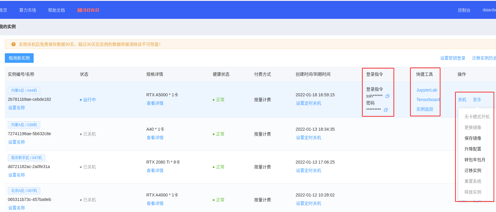

# 服务器操作笔记 - autodl

## 一 autodl

### 1 基础常识

1. 注册学生会员

2. [autodl官方文档](https://www.autodl.com/docs/)

3. 关于实例：实例在则数据在，但是每一个实例只能保存15天，并且这15天内只要实例没有被释放就会每天扣费（不多，但有）

4. 如果git clone显示网络问题，启用autodl自带的学术资源加速：

    ```
    source /etc/network_turbo
    ```

    关闭代理：

    ```
    unset http_proxy && unset https_proxy
    ```

### 2 快速开始

1. 创建实例

    注册后进入控制台，在我的实例菜单下，点击租用新实例

    

    在租用实例页面：选择计费方式，选择合适的主机，选择要创建实例中的GPU数量，选择镜像（内置了不同的深度学习框架），最后创建即可

    

    创建完成后等待开机，今后主要用到的操作入口见截图中

    

2. 终端训练

    在打开的JupyterLab页面中打开终端，执行您的Python命令等完成训练（建议使用后台训练方式）

    

3. vscode训练

    如果习惯用vscode操作而不是jupyter lab，用vscode remote插件进行ssh连接

    [vscode开发环境](https://www.autodl.com/docs/vscode/)

### 3 团队数据管理

我们使用阿里云盘作为团队数据管理中心。(1)
{ .annotate }

1.  :man_raising_hand: aliyun的优点：
    1. 多平台支持, 支持 Windows, macOS, linux(x86/x64/arm), android, iOS 等
    2. 阿里云盘多用户支持
    3. 支持文件网盘，相册网盘无缝切换
    4. 下载网盘内文件, 支持多个文件或目录下载, 支持断点续传和单文件并行下载。支持软链接(符号链接)文件。
    5. 上传本地文件, 支持多个文件或目录上传，支持排除指定文件夹/文件（正则表达式）功能。支持软链接(符号链接)文件。
    6. 同步备份功能支持备份本地文件到云盘，备份云盘文件到本地，双向同步备份保持本地文件和网盘文件同步。常用于嵌入式或者NAS等设备，支持docker镜像部署。
    7. 命令和文件路径输入支持Tab键自动补全
    8. 支持阿里云ECS环境下使用内网链接上传/下载，速度更快(只支持阿里经典网络，最高可达100MB/s)，还可以节省公网带宽流量(配置transfer_url_type=2即可)
    9. 支持webdav文件服务，可以将阿里云盘当做webdav文件网盘挂载到Windows, macOS, linux的磁盘中进行使用。webdav部署支持docker镜像，镜像只有不到10MB非常小巧。
    10. 支持JavaScript插件，你可以按照自己的需要定制上传/下载中关键步骤的行为，最大程度满足自己的个性化需求
    在linux中下载aliyunpan

    原文链接：https://blog.csdn.net/qq_41174671/article/details/127310715

[点击此处查看官方教程](github:https://github.com/tickstep/aliyunpan)


1. 下载与安装

    ```python
    #先进入想将安装包安装在哪里的目录下，然后执行以下命令进行下载
    wget https://github.com/tickstep/aliyunpan/releases/download/v0.2.2/aliyunpan-v0.2.2-linux-amd64.zip
    # download后面接的就是版本号，然后再接发布页的安装包名
    unzip aliyunpan-v0.2.2-linux-amd64.zip #解压安装包
    cd aliyunpan-v0.2.2-linux-amd64  #进入安装包
    ./aliyunpan #启动aliyunpan
    login #登录账号
    ```

2. 登录

    refresh token：b69841de9160458da59d7757887b56c0

3. 查看命令

    ```
    # 获取程序的功能
    help
    # 获取账户文件
    ls
    ```

    非常有用的命令：`help`

3. 下载文件

    通过 `config set -savedir <savedir>` 可以自定义下载文件保存的目录。

    ```
    download 文件名
    ```

4. 上传文件

    ```
    upload <本地文件/目录的路径1> <文件/目录2> <文件/目录3> ... <目标目录>
    ```

    例如，一个上传文件命令示例：

    ```
    upload /root/autodl-fs/poisson_src_bkg.pkl.npy /LHAI
    ```

## 二 开始 - 基础操作

!!!note
    `free -h` : 查看磁盘使用情况  
    `df -h`: 查看系统盘、硬盘容量  
    `nvidia-smi`  

    `python --version` ：检查python版本  
    `python -c "import torch; print(torch.__version__)"` : 检查pytorch版本  
    `nvcc --version` : 检查cuda版本

### 0 一般操作

- ssh连接服务器

    方法1：在终端输入（环境中已下载ssh）

    ```
    ssh -L 8889:localhost:8889 root@111.61.30.143
    ```

    方法2：使用vscode进行服务器编辑：[https://blog.csdn.net/kiong_/article/details/135877723](https://blog.csdn.net/kiong_/article/details/135877723)

    vscode连接服务器使用ipynb文件的小问题：[vscode中 ssh连接服务器后 无法为jupyter文件选择内核kernel](https://blog.csdn.net/jyk19991222/article/details/131486776)

- 如何查看配置

    1.基本系统信息

    `cat /etc/os-release`

    `uname -r` :用于显示当前操作系统使用的内核版本

    2.CPU信息

    `lscpu` :  命令用于显示详细的CPU架构信息，包括CPU型号、核心数、线程数等。

    3.内存信息：

    `free -h` : 查看磁盘使用情况

    4.磁盘信息：

    `lsblk` : 查看分区信息

    `df -h`: 查看系统盘、硬盘容量

    5.显卡信息（训练过程中可以查看显卡占用情况）：

    `nvidia-smi`

### 1 账户文件、环境查看

用 `ls -a`查看所有文件：

```
.   .bash_history  .bashrc  .config             .ipython  .local    .python_history  .sudo_as_admin_successful
..  .bash_logout   .cache   .ipynb_checkpoints  .jupyter  .profile  snap             .viminfo
```
??? tip "."

    . 当前文件

??? tip ".."

    .. 上一级文件

??? tip ".bash_history"

    .bash_history: 这个文件包含了用户在命令行中执行的历史命令记录。每次用户退出登录时，这个文件会被更新。

??? tip ".bash_logout"

    .bash_logout: 当用户退出 Bash shell 时，会执行这个文件中的命令。通常用于清理临时文件或执行其他清理任务。

??? tip ".bashrc"

    .bashrc: 这是 `Bash shell` 的配置文件，用于设置用户的个性化命令别名、环境变量以及其他 Bash shell 的行为。

??? tip ".cache"

    .cache: 这个目录用于存储应用程序的缓存文件。缓存文件可以提高应用程序的性能，但有时也可能占用大量磁盘空间。

??? tip ".config"

    .config: 这个目录通常用于存储用户的应用程序配置文件。许多应用程序会在这个目录下创建子目录来存储它们的配置信息。

??? tip ".ipython"
    
    .ipython: 这个目录包含了 IPython（一个交互式 Python shell）的配置文件和历史记录。

??? tip ".ipynb_checkpoints"
    
    .ipynb_checkpoints: 这个目录是 Jupyter Notebook 自动生成的，用于存储 notebook 文件的检查点版本。这些检查点版本可以用于恢复 notebook 文件的先前状态。（没用）

??? tip ".jupyter"
    
    .jupyter: 这个目录包含了 Jupyter Notebook 的配置文件和相关数据，例如自定义的笔记本模板和扩展。

??? tip ".local"

    .local: 这个目录通常用于存储用户的本地安装的程序和数据。例如，用户可以将 Python 包安装到这个目录中，而不是系统范围内安装。

??? tip ".profile"
    
    .profile: 这是用户登录时执行的 Bourne shell 配置文件。它类似于 .bashrc，但适用于 Bourne shell 及其衍生版本，如 Bash。

??? tip "snap"

    snap: 这个目录包含了通过 Snap 包管理器安装的应用程序。Snap 是一种打包和分发 Linux 应用程序的方法，它将应用程序和它们的依赖项捆绑在一起。

??? tip ".python_history"
    
    .python_history: 这个文件包含了用户在 Python shell 中执行的历史命令记录，类似于 .bash_history。

??? tip ".sudo_as_admin_successful"

    .sudo_as_admin_successful: 这个文件是 sudo 命令生成的，表示上次使用 sudo 命令时身份验证成功。

### 2 文件读写权限：Permission denied

跨账户操作时常遇到。在一个账户时无法打开另一个账户的文件：

```
ylin1@zhliu-X10DRi:~$ cd /home/zhliu
-bash: cd: /home/zhliu: Permission denied
```

解决方法 1 ：使用sudo 命令

```
sudo + 命令
```

解决方法 2 ：使用root身份操作

```
#进入root管理员身份：
sudo -i
#退出root管理员身份：
exit
```

复制文件夹时，常常会遇到权限问题，使用以下代码改变文件夹所有者

```
sudo chown -R ylin1:ylin1 trained_models
```

### 3 账户相关命令

```
# 查看服务器有哪些账户
getent passwd

# 查看当前账户是否具有root权限
sudo -l

# 查看某用户的所有权限
groups username

# 创建账户
sudo adduser newuser

# 给某用户sudo权限
sudo adduser username sudo
```

### 4 后台运行管理

后台运行ipynb文件：

```
nohup runipy ./codes/Train.ipynb 2>&1 &
```

查看后台、查看指定后台、停止后台

注：ps aux 中 Time 的单位是小时（ 7:23 表示 7h23min）

```
# 查看所有后台
ps aux 

# 查看指定用户后台
ps aux | grep username

# 查看 runipy 字符串后台
ps aux | grep runipy

# 停止某个后台
kill PID
```

### 5 系统环境变量

pip安装相关包时出现：

```
WARNING: The script lit is installed in '/home/zywang/.local/bin' which is not on PATH.
```

并且运行一些命令会找不到。如安装jupyter后运行`jupyter notebook` ，可能会报错：

```
Jupyter command `jupyter-notebook` not found.
```

解决方法：

1.打开.bashrc，将需要的变量写入系统环境变量中：

```
echo 'export PATH="$HOME/.local/bin:$PATH"' >> ~/.bashrc
```

2.应用环境变量

```
source ~/.bashrc
```

### 6 配置网络

1. 主要网口："2: enp4s0f0"，打开就可以访问教育网。除lo网口（loop回环）外，网口均为自动获取ip地址。

2. 访问教育网外网方法：

```
# 进入root账户
sudo -i
# 切换到脚本目录
cd /home/jzhang/bin
# 以文本编辑器打开login文件（没有后缀名）
nano login
# 写入以下内容
curl -X POST https://p.nju.edu.cn/api/portal/v1/login -H "Content-type: application/json" -d '{"username":"统一验证账号","password":"统一验证密码"}'
# Ctrl+W写入Ctrl+X关闭，运行脚本
run ./login
```

## 三 VPN(代理)

### 1 基本下载与使用

使用 clash for linux 为云服务器提供代理

[clash for linux github address](https://github.com/wnlen/clash-for-linux)

1. 下载 `clash for linux`

    （1）从github上下载

    ```
    git clone https://github.com/wanhebin/clash-for-linux.git
    ```

    （2）从aliyunpan上下载

2. 修改订阅代理URL

    ```
    cd clash-for-linux
    vim .env
    ```

    在自己订阅的代理网站上获取 subscription URL，粘贴到 `.env` 文件的 clash URL，secret一般不用管

3. 使用 `clash for linux`

    ```
    cd clash-for-linux
    bash start.sh
    source /etc/profile.d/clash.sh
    proxy_on
    ```

    正常弹窗为：

    ```
    正在检测订阅地址...
    Clash订阅地址可访问！                                      [  OK  ]

    正在下载Clash配置文件...
    配置文件config.yaml下载成功！                              [  OK  ]

    正在启动Clash服务...
    服务启动成功！                                             [  OK  ]

    Clash Dashboard 访问地址：http://<ip>:9090/ui
    Secret：xxxxxxxxxxxxx

    请执行以下命令加载环境变量: source /etc/profile.d/clash.sh

    请执行以下命令开启系统代理: proxy_on

    若要临时关闭系统代理，请执行: proxy_off
    ```

4. 检验环境变量，以及是否开启代理

    ```
    $ env | grep -E 'http_proxy|https_proxy'
    http_proxy=http://127.0.0.1:7890 # 下面两个是cmd输出
    https_proxy=http://127.0.0.1:7890
    ```

    检查是否代理顺利：

    ```
    wget www.youtube.com
    ```

    如果不是一直在连接，就可以使用了。

### 2 ipynb文件使用

首先在cmd中打开代理 proxy_on，然后在第一个单元格加入：

```
# 在 Jupyter Notebook 中设置代理
import os

os.environ["http_proxy"] = "http://127.0.0.1:7890" # 这几个ip地址设置为上面 env | grep -E 'http_proxy|https_proxy'输出的地址
os.environ["https_proxy"] = "http://127.0.0.1:7890"
os.environ["all_proxy"] = "socks5://127.0.0.1:7890" # 这个可以不要
```

### 3 python文件使用

首先在cmd中打开代理 proxy_on，然后在python代码中加入：

```
import requests

# 配置代理
proxies = {
    "http": "http://127.0.0.1:7890",
    "https": "http://127.0.0.1:7890",
}

# 测试请求
try:
    response = requests.get("https://www.google.com", proxies=proxies)
    print("代理测试成功，状态码：", response.status_code)
except Exception as e:
    print("代理测试失败：", e)

```

## 四 数据

### 1 上传数据

1. 公网网盘，直接使用阿里云盘、百度网盘上传下载数据
- JupyterLab上传，和网盘类似，优点简单，但是只支持文件不支持文件夹
- scp命令支持文件和文件夹上传下载，命令行执行
- FileZilla软件支持文件和文件夹，拖拉拽即可上传下载，推荐使用
- XShell软件支持管理SSH连接，而且集成了xftp，支持拖拉拽上传下载文件夹/文件，推荐使用

### 2 下载数据

1. JupyterLab可以下载文件，但是不能下载文件夹，好处是简单易用

2. 公网网盘，直接使用阿里云盘、百度网盘上传下载数据

3. scp命令支持文件和文件夹

    下载文件：

    ```
    scp -P 40233 root@connect.westb.seetacloud.com:/root/data/result.txt ./

    ```

    下载文件夹：

    ```
    scp -P 40233 -r root@connect.westb.seetacloud.com:/root/data ./data_local_copy
    ```

## 五 环境配置-anaconda

### 1 安装anaconda

如果当前服务器没有anaconda，需要下载。

- x86架构

`uname -a` 查看架构类型

下载压缩包：

```
wget https://repo.anaconda.com/archive/Anaconda3-2021.11-Linux-x86_64.sh
```

解压：

```
bash Anaconda3-2021.11-Linux-x86_64.sh -b -p /fsa/home/ww_liuzh/anaconda
```

- aarch64架构（华为服务器）

```
wget -c https://repo.anaconda.com/archive/Anaconda3-2021.05-Linux-aarch64.sh
```

### 2 设置到系统环境变量

打开.bashrc，并添加路径到环境变量

```
vim .bashrc

# 添加：
export PATH="/fsa/home/ww_liuzh/anaconda/bin:$PATH"

# 激活：（我老是忘记）
source ~/.bashrc
```

### 3 创建虚拟环境

```bash
# 创建（自动继承base所有包）
conda create -n env_name python=3.10.14
# 创建（不继承任何包）
conda create --name env_name python=3.6.8 --no-default-packages
# 激活
conda activate env_name
# 退出
conda deactivate
# 列出环境
conda list
# 删掉环境
conda env remove -n env_name
# 创建环境文件（conda版，pip同样使用。实际上，pip也一样）
conda env export > environment.yml
# 还原环境
conda env create -f environment.yml
```

### 4 在jupyter notebook中引用虚拟环境

运行jupyter的时候，如果要引用某个conda创建的虚拟，需要添加某个虚拟环境到Kernel，见：

[https://zhuanlan.zhihu.com/p/160997771](https://zhuanlan.zhihu.com/p/160997771)

1. 进入虚拟环境（重要）
2. 安装ipykernel  
```
#conda安装
conda install -c anaconda ipykernel
# pip安装方法
pip install ipykernel
```
3. 在ipykernel中添加虚拟环境名称，--name后面对应设置的环境名称  
```
python -m ipykernel install --user --name=my_env
```
>> 附：**ipykernel相关操作**  
>> 1. 列出已安装的kernel:  `jupyter kernelspec list`，附带每个kernel所在路径  
>> 2. 查看制定kernel路径: `jupyter kernelspec list | grep my_env`

## 六 DOCKER

### 1 应用场景

使用Docker在轻量应用服务器上搭建应用服务，例如：

- 搭建个人博客或网站，使用Docker可以快速部署Web应用程序，并确保每个环境的一致性。

- 构建开发环境，Docker可以轻松地为每个项目创建一个隔离的环境，确保开发工具和依赖项的一致性。

- 部署数据库服务，例如MySQL、PostgreSQL等，Docker可以简化数据库的安装和配置过程。

### 2 操作

`docker ps`：查看正在运行的容器。  
`docker start/stop`：启动或停止容器。  
`docker rm`：删除容器。  
`docker logs`：查看容器的日志。  
`docker exec`：在容器内执行命令。  