# CNN 类神经网络

1. 看一下eval的input，每一次是否都相同，为什么会有0.1左右的波动

2. 对同一个模型的同一个参数，eval产生0.1的波动是正常现象。

## DEFAULT 参数

实验参数：

```
- 📦 实验名称                : EXP01
- 🧠 模型名称                : CNN
- 📁 模型脚本路径            : /root/LHAI/codes/models/CNN.py
- 📂 数据文件路径            : /root/LHAI/data/Train/xingwei_10000_64_train_v1.npy
- 📊 数据集切分比例          : 训练集 98.0% / 测试集 2.0%
- 📈 样本总数                : 10000
- 🔁 总训练轮数（Epochs）     : 400
- 📦 批次大小（Batch Size）  : 32
- 🌱 随机种子（Seed）        : 0
- 🔢 数据归一化范围          : 1.0
- 📉 学习率策略（Cosine）    : 最小 = 5.0e-06, 最大 = 5.0e-04
- 🧪 损失函数（Loss）        : msejsloss
- 🛠️ 优化器（Optimizer）     : AdamW
- 💻 使用设备（Device）      : cuda:0（NVIDIA GeForce RTX 4090）
- 📁 log保存地址             : /root/LHAI/saves/TRAIN/LOGS/trainlog_CNN
```

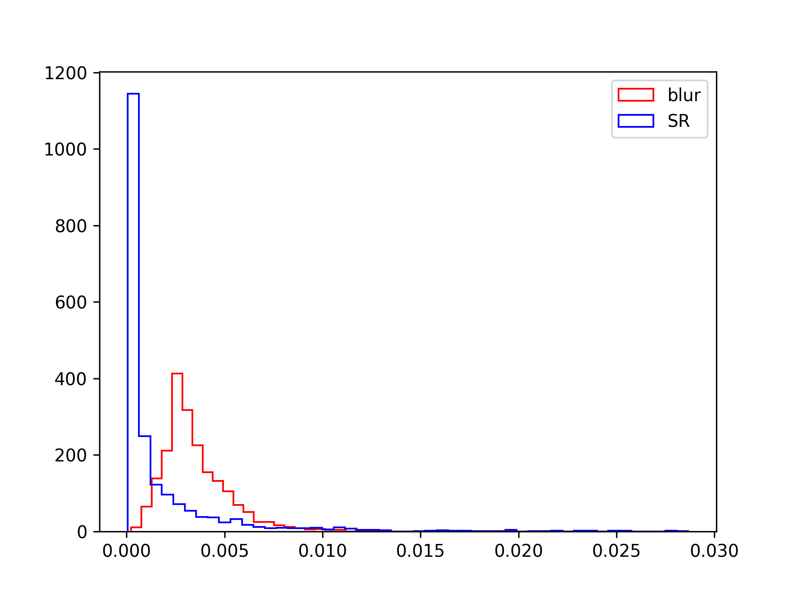{width="600"}

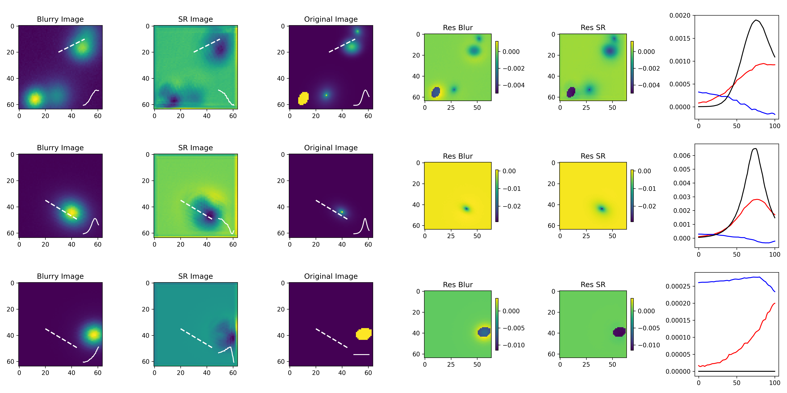{width="600"}

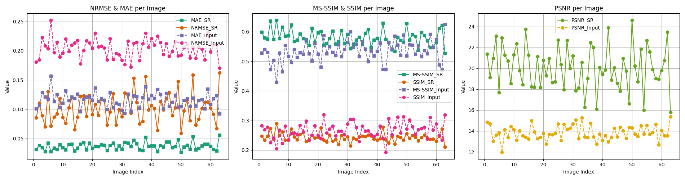{width="600"}

平均数据：

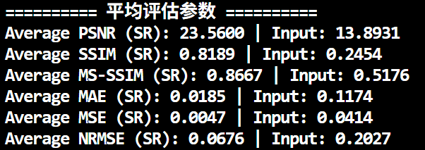{width="400"}

## dataprocess 参数

```
Average PSNR (SR): 18.2133
Average PSNR (Input): 13.2108
Average SSIM (SR): 0.2278
Average SSIM (Input): 0.2459
Average MS-SSIM (SR): 0.5334
Average MS-SSIM (Input): 0.5216
Average MAE (SR): 0.0427
Average MAE (Input): 0.1312
Average MSE (SR): 0.0157
Average MSE (Input): 0.0485
Average NRMSE (SR): 0.1241
Average NRMSE (Input): 0.2193
```

## DEFAULT Model - 400epochs

实验参数：

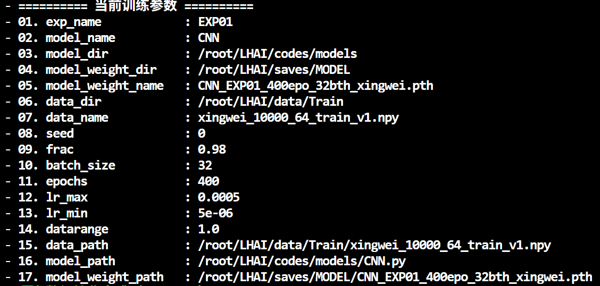{width="400"}

评估结果：

{width="400"}

## CARN_v1

实验参数：

{width="400"}

评估结果：

{width="400"}

## CARN_v2

实验参数：

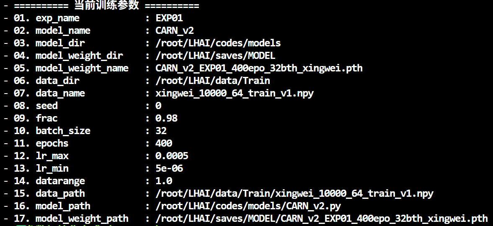{width="400"}

评估结果：

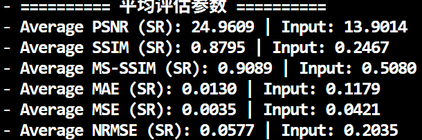{width="400"}

## DRCN

实验参数：

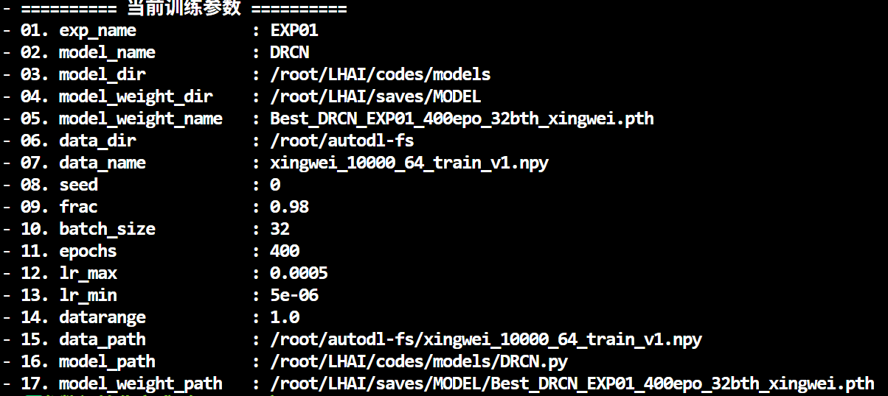{width="400"}

评估结果：

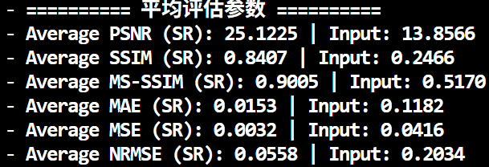{width="400"}

## EDSR

实验参数：

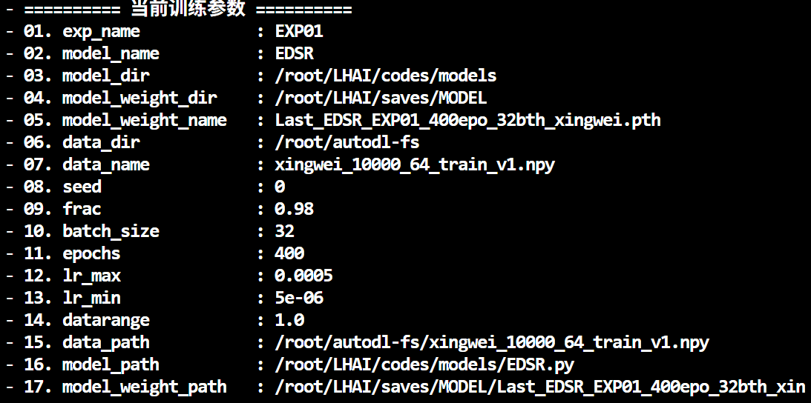{width="400"}

评估结果：

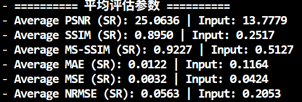{width="400"}

## SRCNN_Transformer

实验参数：

400epochs

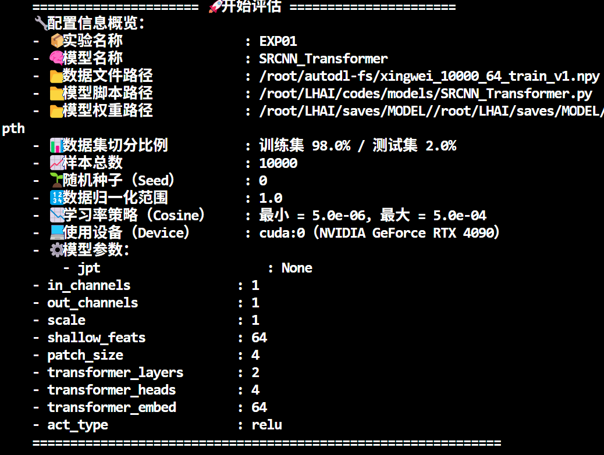{width="400"}

评估结果：

{width="400"}

## SwinIR_LHAI

实验参数：

400epochs

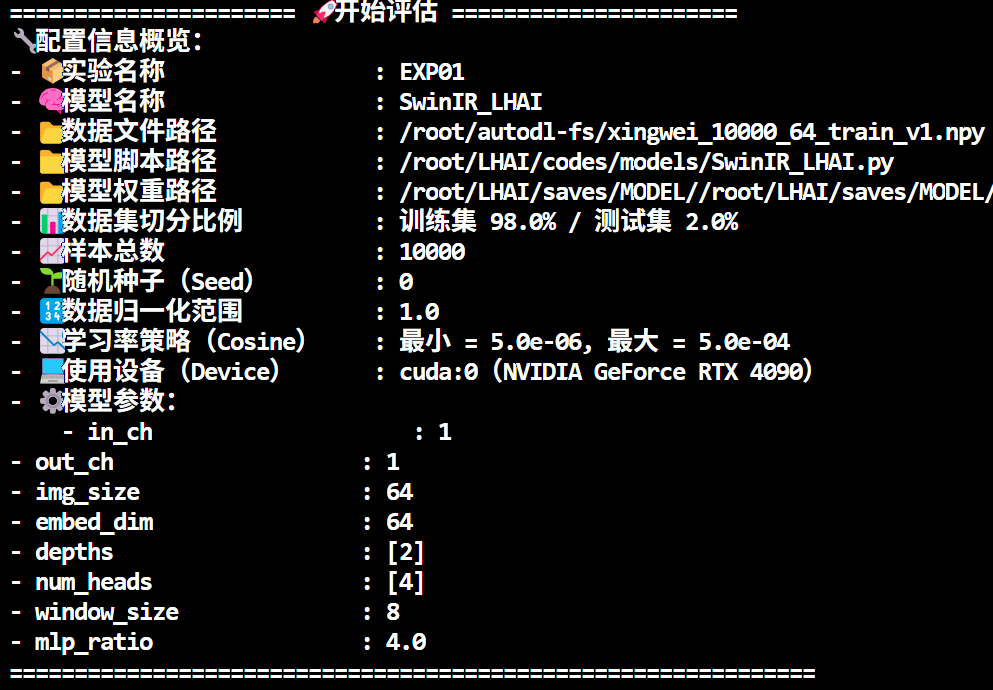{width="400"}

评估结果：

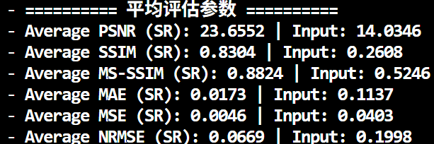{width="400"}

## ESPCN

实验参数：

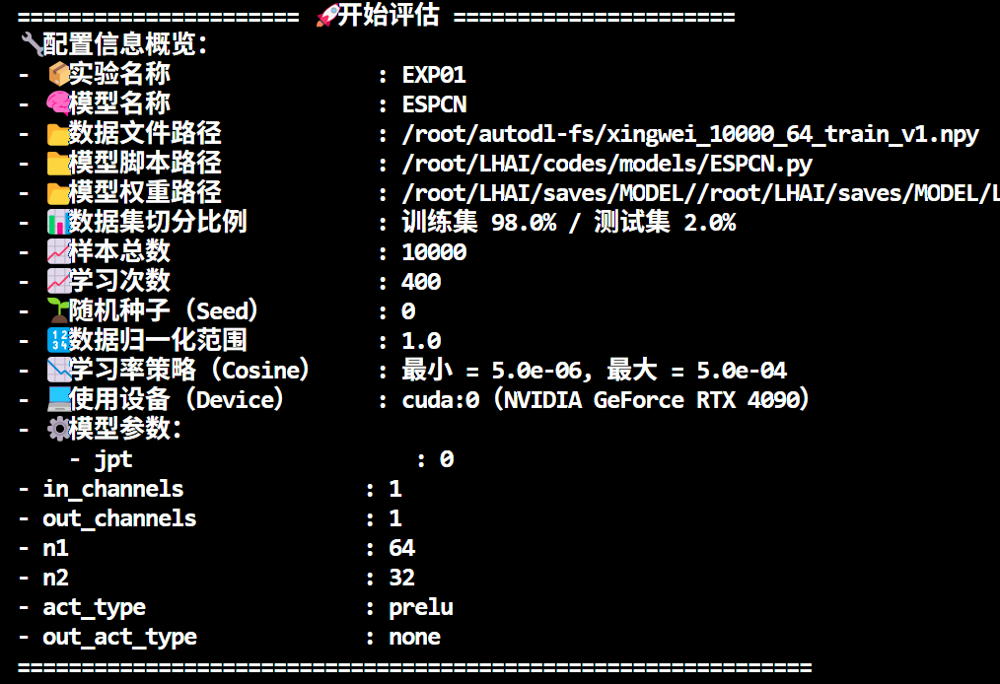{width="400"}

评估结果：

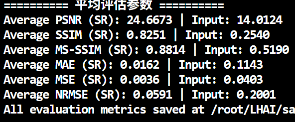{width="400"}
