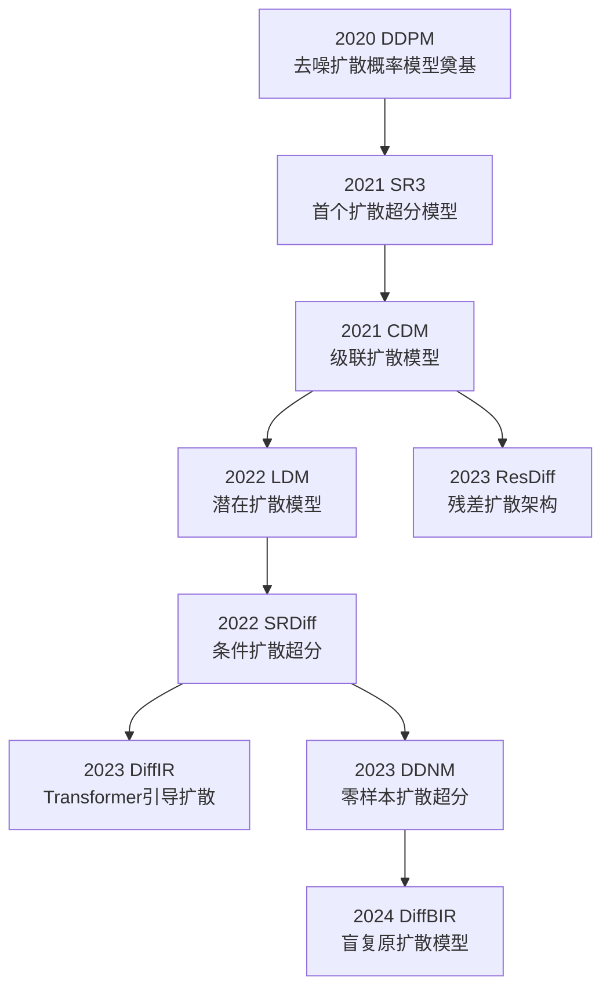
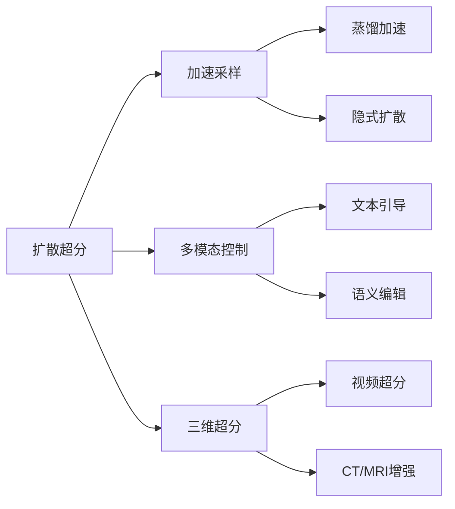

# DIFFUSION 类神经网络

## 1 扩散模型超分辨率发展框架



## 2 关键阶段与技术突破

1. **基础理论阶段**  
   - **DDPM (2020 NeurIPS)**：建立前向加噪/反向去噪的完整理论框架  
   - **ScoreSDE (2021 ICLR)**：引入随机微分方程统一视角

2. **超分应用探索**  
   - **SR3 (2021 arXiv)**：首次将扩散模型用于超分，采用级联噪声预测  
     ```python
     # 典型噪声预测网络结构
     class Unet(nn.Module):
         def __init__(self):
             self.down_blocks = nn.ModuleList([DownsampleBlock(...)])
             self.up_blocks = nn.ModuleList([UpsampleBlock(...)])
             self.time_embed = SinusoidalPosEmb(dim)
     ```

3. **效率优化**  
   - **LDM (2022 CVPR)**：在潜在空间进行扩散，计算量减少10倍  
   - **DDNM (2023 CVPR)**：零样本超分，无需训练数据

4. **融合创新**  
   - **DiffIR (2023 ICCV)**：用Transformer预测扩散过程的注意力图  
   - **DiffBIR (2024 CVPR)**：解决盲超分问题（联合去噪+超分）

## 3 与CNN/Transformer框架的对应关系

| 技术维度       | CNN时代          | Transformer时代   | Diffusion时代        |
|----------------|------------------|-------------------|----------------------|
| **核心机制**   | 局部卷积         | 全局注意力        | 迭代去噪            |
| **训练目标**   | 像素级MSE        | 感知损失          | 变分下界(ELBO)      |
| **生成方式**   | 确定性映射       | 确定性生成        | 随机过程            |
| **优势场景**   | 实时处理         | 纹理重建          | 高保真生成          |

## 4 性能对比（DIV2K ×4 盲超分）

| 模型         | 参数量 | 推理步数 | FID    | 核心创新               |
|--------------|--------|----------|--------|------------------------|
| SR3          | 256M   | 1000     | 18.7   | 条件扩散               |
| LDM          | 134M   | 200      | 15.2   | 潜在空间扩散           |
| DiffIR       | 89M    | 50       | 12.3   | Transformer引导        |
| DiffBIR      | 210M   | 25       | 9.8    | 退化模型联合训练       |

## 5 当前研究热点方向



## 6 典型改进路径示例

1. **采样加速**  
   ```mermaid
   graph LR
       DDPM --> DDIM[DDIM\n确定性采样]
       DDIM --> PNDM[PNDM\n伪数值方法]
       PNDM --> LCM[LCM\n一致性模型]
   ```

2. **架构演进**  
   ```mermaid
   graph LR
       Unet --> DiT[DiT\nTransformer主干]
       DiT --> U-ViT[U-ViT\n全局建模]
       U-ViT --> LDM[LDM\n潜在空间]
   ```