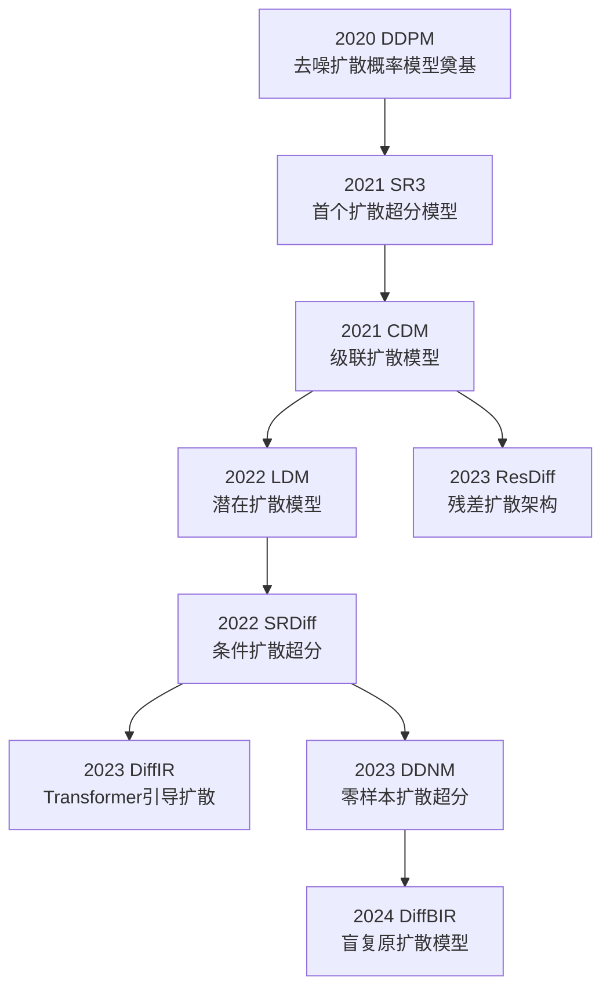
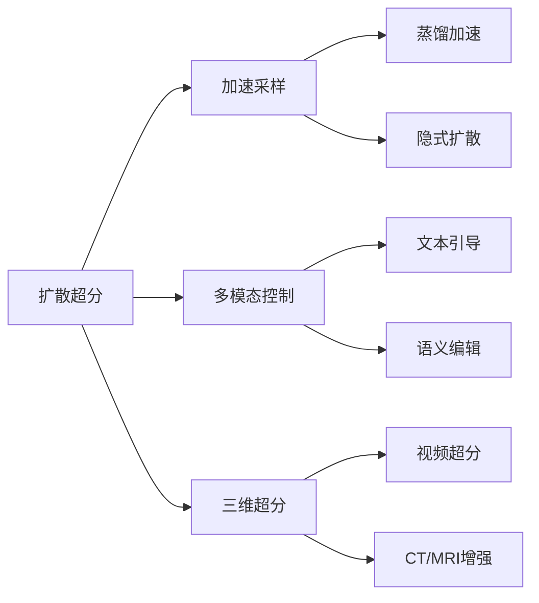

# DIFFUSION 类神经网络

## 1 扩散模型超分辨率发展框架



## 2 DIFFUSION 核心特色与原理

扩散模型（Diffusion Model）可以看作是一个 **逐步加噪 → 学习去噪** 的生成框架，通过反向扩散过程从噪声重构出清晰图像。它的核心构成可浓缩为 **四大支柱**：

1. **前向扩散过程（Forward Diffusion Process）** —— 将真实图像逐步加噪至高斯噪声
2. **反向生成过程（Reverse Process）** —— 学习从噪声逐步去噪重建图像
3. **时间步条件编码（Timestep Embedding）** —— 表示当前生成过程的进度
4. **条件控制机制（Conditional Guidance）** —— 将超分或其他条件信息引入去噪过程

### 2.1 前向扩散过程（Forward Process）

**思想**

前向过程是一个固定的马尔可夫链，将数据分布 $x_0$ 逐步加噪至各向同性高斯分布 $x_T \sim \mathcal{N}(0, I)$。
这样，模型只需学习逆过程即可生成图像。

**数学原理**

前向过程定义为：

$$
q(x_t | x_{t-1}) = \mathcal{N}\left(x_t; \sqrt{1-\beta_t} \, x_{t-1}, \beta_t I \right)
$$

其中：

* $t \in \{1, \dots, T\}$ 为时间步
* $\beta_t$ 为噪声强度调度（Noise Schedule）

由于高斯的可传递性，可以直接写成：

$$
q(x_t | x_0) = \mathcal{N}\left(x_t; \sqrt{\bar{\alpha}_t} \, x_0, (1-\bar{\alpha}_t)I \right)
$$

其中：

$$
\alpha_t = 1 - \beta_t, \quad \bar{\alpha}_t = \prod_{s=1}^t \alpha_s
$$

---

### 2.2 反向生成过程（Reverse Process）

**思想**

反向过程是另一个马尔可夫链，目标是估计：

$$
p_\theta(x_{t-1} | x_t) = \mathcal{N}\left(x_{t-1}; \mu_\theta(x_t, t), \Sigma_\theta(x_t, t) \right)
$$

其中 $\mu_\theta$ 由神经网络（如 U-Net、Transformer）预测。

为了简化训练，DDPM 将 $\mu_\theta$ 改为预测噪声 $\epsilon_\theta(x_t, t)$，并直接优化：

$$
\mathcal{L}_{\text{simple}} = \mathbb{E}_{x_0, \epsilon, t}\left[ \| \epsilon - \epsilon_\theta(x_t, t) \|_2^2 \right]
$$

这样，模型学会在任意时间步去除噪声。

### 2.3 时间步条件编码（Timestep Embedding）

由于去噪过程依赖时间步 $t$，需要将 $t$ 映射为特征向量并注入网络：

* **正余弦编码**（类似 Transformer 位置编码）：

$$
\text{TE}_{(t, 2i)} = \sin\left(\frac{t}{10000^{2i/d}}\right), \quad
\text{TE}_{(t, 2i+1)} = \cos\left(\frac{t}{10000^{2i/d}}\right)
$$

* 或 **可学习嵌入**（Learnable Embedding）

### 2.4 条件控制机制（Conditional Guidance）

在超分任务中，模型除了接收噪声输入 $x_t$，还会接收低分辨率图像 $y$ 作为条件：

$$
\epsilon_\theta(x_t, t, y)
$$

常见方式：

* **直接拼接**（在通道维度拼接 $x_t$ 与上采样后的 $y$）
* **条件编码**（将 $y$ 编码后作为附加输入注入网络特征层）

这种机制确保去噪过程受低分辨率图像约束，生成的高分辨率图像既符合数据分布，又与输入一致。

### 2.5 PyTorch 核心实现示例

```python
import torch
import torch.nn as nn

class SimpleDDPM(nn.Module):
    def __init__(self, model, betas):
        super().__init__()
        self.model = model  # U-Net or Transformer
        self.betas = betas
        self.alphas = 1.0 - betas
        self.alpha_bars = torch.cumprod(self.alphas, dim=0)

    def forward_diffusion(self, x0, t):
        noise = torch.randn_like(x0)
        sqrt_alpha_bar = self.alpha_bars[t] ** 0.5
        sqrt_one_minus = (1 - self.alpha_bars[t]) ** 0.5
        xt = sqrt_alpha_bar[:, None, None, None] * x0 + \
             sqrt_one_minus[:, None, None, None] * noise
        return xt, noise

    def p_loss(self, x0, t):
        xt, noise = self.forward_diffusion(x0, t)
        pred_noise = self.model(xt, t)
        return torch.mean((noise - pred_noise) ** 2)
```

### 2.6 核心总结（对标 CNN）

| 模块功能 | CNN 对应    | Diffusion 对应               |
| ---- | --------- | -------------------------- |
| 特征提取 | 卷积核提取局部模式 | 去噪网络提取并还原信号                |
| 生成逻辑 | 前向卷积映射    | 逐步去噪重建                     |
| 条件控制 | 输入通道堆叠    | 条件引导（Conditional Guidance） |
| 时间控制 | 固定深度网络    | 时间步嵌入                      |

**一句话核心：** CNN 是一次性映射，Diffusion 是逐步生成；CNN 专注局部卷积，Diffusion 通过多步去噪建模全局分布。

由高斯模糊，模拟加噪过程

然后训练一个模型，让它能够从噪声中恢复出原始图像/或者能够拟合出噪声

这样就能得到清晰的图像。

## 2 关键阶段与技术突破

1. **基础理论阶段**  
      - **DDPM (2020 NeurIPS)**：建立前向加噪/反向去噪的完整理论框架  
      - **ScoreSDE (2021 ICLR)**：引入随机微分方程统一视角

2. **超分应用探索**  
      - **SR3 (2021 arXiv)**：首次将扩散模型用于超分，采用级联噪声预测  
        ```python linenums="1"
        # 典型噪声预测网络结构
        class Unet(nn.Module):
            def __init__(self):
                self.down_blocks = nn.ModuleList([DownsampleBlock(...)])
                self.up_blocks = nn.ModuleList([UpsampleBlock(...)])
                self.time_embed = SinusoidalPosEmb(dim)
        ```

3. **效率优化**  
      - **LDM (2022 CVPR)**：在潜在空间进行扩散，计算量减少10倍  
      - **DDNM (2023 CVPR)**：零样本超分，无需训练数据

4. **融合创新**  
      - **DiffIR (2023 ICCV)**：用Transformer预测扩散过程的注意力图  
      - **DiffBIR (2024 CVPR)**：解决盲超分问题（联合去噪+超分）

## 3 与CNN/Transformer框架的对应关系

| 技术维度       | CNN时代          | Transformer时代   | Diffusion时代        |
|----------------|------------------|-------------------|----------------------|
| **核心机制**   | 局部卷积         | 全局注意力        | 迭代去噪            |
| **训练目标**   | 像素级MSE        | 感知损失          | 变分下界(ELBO)      |
| **生成方式**   | 确定性映射       | 确定性生成        | 随机过程            |
| **优势场景**   | 实时处理         | 纹理重建          | 高保真生成          |

## 4 性能对比（DIV2K ×4 盲超分）

| 模型         | 参数量 | 推理步数 | FID    | 核心创新               |
|--------------|--------|----------|--------|------------------------|
| SR3          | 256M   | 1000     | 18.7   | 条件扩散               |
| LDM          | 134M   | 200      | 15.2   | 潜在空间扩散           |
| DiffIR       | 89M    | 50       | 12.3   | Transformer引导        |
| DiffBIR      | 210M   | 25       | 9.8    | 退化模型联合训练       |

## 5 当前研究热点方向



## 6 典型改进路径示例

1. **采样加速**  
   ```mermaid
   graph LR
       DDPM --> DDIM[DDIM\n确定性采样]
       DDIM --> PNDM[PNDM\n伪数值方法]
       PNDM --> LCM[LCM\n一致性模型]
   ```

2. **架构演进**  
   ```mermaid
   graph LR
       Unet --> DiT[DiT\nTransformer主干]
       DiT --> U-ViT[U-ViT\n全局建模]
       U-ViT --> LDM[LDM\n潜在空间]
   ```