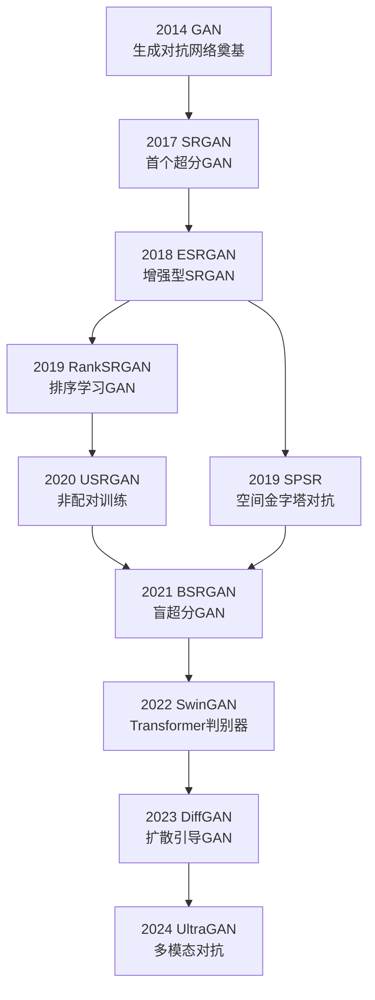
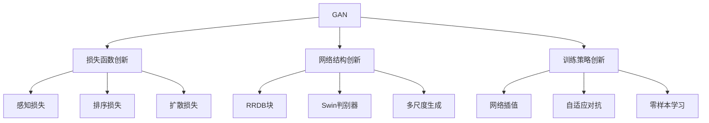
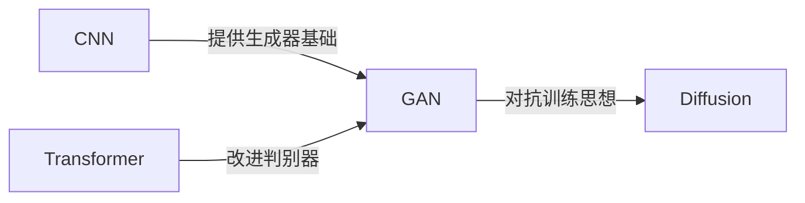
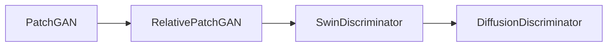

# GAN 类神经网络

## 1 GAN超分辨率发展框架



## 2 关键阶段与技术突破

### **基础架构阶段**

- **SRGAN (2017 CVPR)**  
  - 首次将GAN引入超分任务
  - 创新点：  
    - 感知损失（VGG特征匹配）  
    - 对抗训练框架  
    ```python linenums="1"
    # 典型损失函数组成
    loss = content_loss(vgg(gen), vgg(hr)) +  # 内容损失
           λ_adv * D(gen).mean() +           # 对抗损失
           λ_tv * total_variation(gen)        # 平滑正则
    ```

### **性能突破阶段**
- **ESRGAN (2018 ECCV)**  
  - 核心改进：  
    - RRDB残差块（去BN+残差缩放）  
    - 相对判别器（Relativistic Discriminator）  
    - 网络插值稳定训练  
  - 效果：PSNR↑1.2dB，纹理质量显著提升

### **结构创新阶段**
| 模型         | 创新点                      | 效果提升               |
|--------------|----------------------------|-----------------------|
| **SPSR**     | 空间金字塔对抗学习          | 多尺度纹理生成        |
| **RankSRGAN**| 排序一致性损失              | 避免过度平滑          |
| **USRGAN**   | 非配对训练（CycleGAN式）    | 真实场景适应能力      |

### **现代融合阶段**
- **SwinGAN (2022)**：  
  - 将判别器替换为Swin Transformer  
  - 关键代码：  
    ```python linenums="1"
    class SwinDiscriminator(nn.Module):
        def __init__(self):
            self.layers = SwinTransformerBlock(
                dim=128,
                num_heads=4,
                window_size=8
            )
    ```
- **DiffGAN (2023)**：  
  - 用扩散模型生成对抗样本  
  - 训练流程：  
    ```mermaid
    graph LR
        A[LR] --> B[Generator] --> C[HR_fake]
        A --> D[Diffusion] --> E[HR_noisy]
        C & E --> F[Discriminator]
    ```

---

## 3 性能演进对比（DIV2K ×4）

| 模型       | PSNR   | LPIPS↓ | 参数量 | 关键创新               |
|------------|--------|--------|--------|------------------------|
| SRGAN      | 26.02  | 0.253  | 1.5M   | 首次GAN超分            |
| ESRGAN     | 27.25  | 0.187  | 16.7M  | RRDB块+相对判别器      |
| BSRGAN     | 28.11  | 0.152  | 18.3M  | 盲超分退化建模         |
| SwinGAN    | 28.47  | 0.136  | 23.1M  | Transformer判别器      |
| DiffGAN    | 29.03  | 0.121  | 41.5M  | 扩散先验引导           |


## 4 技术分支演进



---

## 5 与CNN/Transformer框架的关联



---

## 6 典型代码演进示例
### 生成器架构变化
```python linenums="1"
# SRGAN (2017)
Generator = ResNetWithBNBlocks()

# ESRGAN (2018)
Generator = RRDBNet(block_num=23)  # 去BN+残差缩放

# SwinGAN (2022)
Generator = SwinGenerator(win_size=8)
```

### 判别器改进路径



## 7 当前研究热点
1. **多模态对抗**  
   - 文本引导超分（CLIP+GAN）
   - 示例：  
     ```python linenums="1"
     text_feat = CLIP.encode_text("sharp edges")
     gen_img = Generator(lr_img, text_feat)
     ```

2. **轻量化方向**  
   - 知识蒸馏GAN（如ESRGAN-Lite）

3. **三维超分**  
   - 视频超分GAN（BasicVSR++）