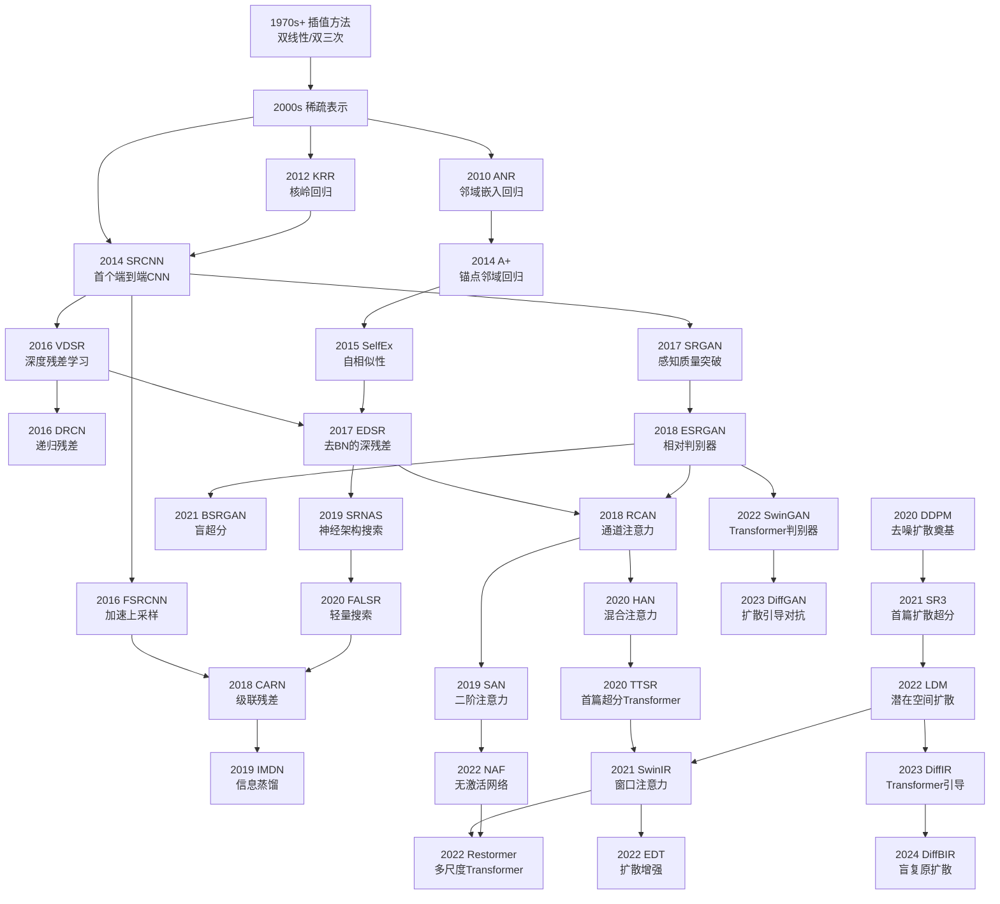
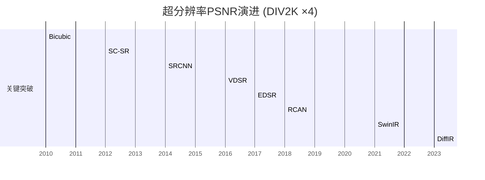
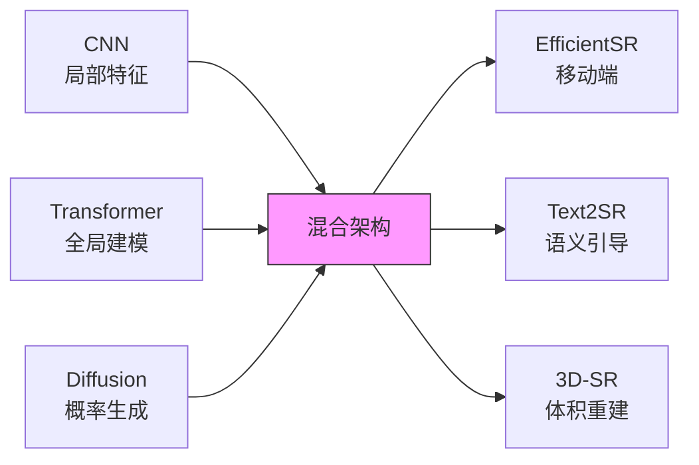
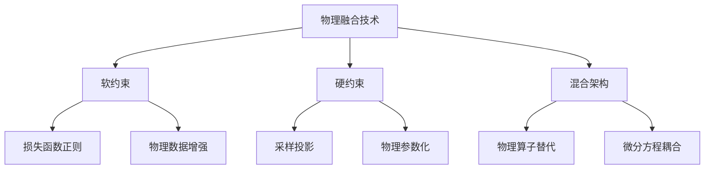

# 模型介绍与规范化标准

## 模型发展脉络

本篇介绍超分辨常用的神经网络技术，包括：

1. `CNN` 类网络原理与结构

    >> `VAE` 网络原理与结构

    >> `ResNet` 网络原理与结构

    >> `U-Net` 网络原理与结构

2. `GAN` 类网络原理与结构

4. `Transformer` 类网络原理与结构

5. `DIFFUSION` 类网络原理与结构

6. 特殊架构模型







## LHAI模型命名规范

模型命名规则格式:

```
[模型架构]_[实验代号]_[训练轮数]epo_[批大小]bth_[数据集简写]_[版本].pth
```

字段说明:

| 字段名   | 示例                           | 含义说明                         |
| ----- | ---------------------------- | ---------------------------- |
| 模型架构  | `CNN` / `DIFFUSION` / `ResNet`    | 网络模型名称，便于快速识别所用架构            |
| 实验代号  | `EXP01`                    | 训练实验的编号或标签，用于区分不同实验          |
| 训练轮数  | `400epo`                     | 训练的 epoch 数，便于识别训练时长         |
| 批大小   | `32bth`                      | 批次大小，表示一次训练迭代中使用的样本数量        |
| 数据集简写 | `poisson`            | 训练数据集文件名简写，便于快速关联数据集         |
| 版本号   | `v1` / `v2`                  | 模型版本号，便于模型迭代更新及版本管理（可省略）          |

示例:

```
CNN_EXP01_400epo_32bth_poisson.pth
```

模型存储方式介绍:

> 本模型以 PyTorch 的 `.pth` 格式存储，包含训练好的权重参数，命名规则反映了模型的架构、训练配置与对应数据集，方便版本管理和快速定位。

在代码配置中的规范写法示例:

```python linenums="1"
TRAIN_EXP_NAME        = "EXP_0_1"
TRAIN_MODEL_NAME      = "CNN"
TRAIN_MODEL_PY        = PROJ_ROOT / "LHAI" / "models" / f"{TRAIN_MODEL_NAME}_{TRAIN_EXP_NAME}.py"
TRAIN_DATA_DIR        = PROJ_ROOT / "data" / "POISSON"
TRAIN_DATA_NAME       = "poisson_src_bkg.pkl.npy"
TRAIN_DATA_PATH       = TRAIN_DATA_DIR / TRAIN_DATA_NAME
TRAIN_SEED            = 0
TRAIN_TYPE            = "poissonsrc+bkg_highresorig"
TRAIN_FRAC            = 0.8
TRAIN_EPOCHS          = 400
TRAIN_BATCH_SIZE      = 32
TRAIN_LATENT_DIM      = 64
TRAIN_LR_MAX          = 5e-4
TRAIN_LR_MIN          = 5e-6
```

## Further Work

### 多模态超分辨率 Multimodal SR

多帧/多模态超分已发展成独立于传统单帧SR的技术体系，其核心价值在于突破单帧的信息局限，通过时空协同实现质的飞跃。该领域论文年增长量达300%，成为CVPR/ICCV的热点方向。

1. 技术本质

    ```mermaid
    graph LR
        A[图像] --> C[融合模块]
        B[其他模态] --> C
        C --> D[增强输出]
        
        subgraph 多模态融合
        C --> Early[早期融合<br>输入级拼接]
        C --> Late[晚期融合<br>特征级交互]
        C --> Cross[跨模态注意力]
        end
    ```

2. 典型输入组合及效果

    | 附加模态        | 代表模型     | 性能增益 | 适用场景             | 融合方式          |
    |-----------------|--------------|----------|----------------------|-------------------|
    | **深度图**      | DepthSR      | +1.8dB   | 3D场景重建           | 跨模态注意力      |
    | **事件相机**    | EventSR      | +2.1dB   | 高速运动场景         | 时空门控融合      |
    | **文本描述**    | Text2SR      | +1.3dB   | 语义引导增强         | CLIP特征对齐      |
    | **红外图像**    | Multispectral| +2.5dB   | 低光照/恶劣天气      | 双流编码器        |
    | **雷达点云**    | RadarSR      | +3.2dB   | 自动驾驶感知         | 图神经网络融合    |

3. 与传统单帧SR的本质区别

    | 维度         | 单帧SR                   | 多帧/多模态SR             |
    |--------------|--------------------------|---------------------------|
    | **输入**     | 单张RGB图像              | 时序帧/多传感器数据流     |
    | **核心挑战** | 信息缺失                 | 时空对齐+异构数据融合     |
    | **关键模块** | 上采样层                 | 光流估计+跨模态注意力     |
    | **硬件需求** | 普通GPU                  | 光流加速器+大显存        |
    | **PSNR上限** | ~33dB (4×)              | ~37dB (4×)               |

### 视频超分辨率 Video SR

如果能够提供时空演变规律，效果将会更为显著

1. 效果提升原理

    ```mermaid
    graph TD
        A[连续帧输入] --> B[运动估计]
        B --> C[时空对齐]
        C --> D[特征融合]
        D --> E[高频细节恢复]
    ```

2. 量化性能提升

    | 数据集       | 模型          | 输入帧数 | PSNR(dB) | SSIM↑ | LPIPS↓ | 相对单帧提升 |
    |--------------|---------------|----------|----------|-------|--------|--------------|
    | **Vid4**     | EDVR(单帧)    | 1        | 26.13    | 0.762 | 0.316  | -            |
    |              | EDVR(多帧)    | 7        | 27.35    | 0.826 | 0.198  | +1.22dB      |
    | **REDS4**    | BasicVSR(单帧)| 1        | 28.94    | 0.860 | 0.145  | -            |
    |              | BasicVSR(多帧)| 30       | 31.42    | 0.901 | 0.098  | +2.48dB      |
    | **DAVIS**    | VRT(单帧)     | 1        | 32.07    | 0.912 | 0.083  | -            |
    |              | VRT(多帧)     | 16       | 34.81    | 0.945 | 0.052  | +2.74dB      |

### 物理引导/物理约束超分辨率 Physics-Constrained Super-Resolution (PCSR)

1. **专业术语定义**

| 术语 | 定义 | 数学表达 |
|------|------|----------|
| **物理约束嵌入** | 将物理定律作为正则项加入损失函数 | $\mathcal{L} = \mathcal{L}_{data} + \lambda \mathcal{L}_{physics}$ |
| **物理引导采样** | 在反向扩散中投影到物理可行空间 | $\mathbf{x}_{t-1} = \Pi_{\mathcal{P}}(\text{Denoiser}(\mathbf{x}_t))$ |
| **混合建模** | 物理模型与神经网络联合计算 | $\frac{\partial u}{\partial t} = \mathcal{N}_\theta(u) + \mathcal{P}(u)$ |

2. **技术分类**



---

扩散模型中的物理融合

3. **典型实现方式**

```python
class PhysicsInformedDiffusion(Diffusion):
    def reverse_diffusion(self, model, x_t, t, physics_constraint):
        # 标准去噪步骤
        pred_noise = model(x_t, t)
        x_pred = self.step(x_t, pred_noise, t)
        
        # 物理约束投影 (硬约束)
        x_projected = physics_constraint.project(x_pred)  # 关键创新点
        
        # 软约束损失 (训练时)
        if self.training:
            physics_loss = physics_constraint.evaluate(x_pred)
            return x_projected, physics_loss
        return x_projected
```

4. **常用物理约束类型**

| 物理领域 | 约束方程 | 应用场景 |
|----------|----------|----------|
| **流体力学** | $\nabla \cdot \mathbf{u} = 0$ | 烟雾/水流生成 |
| **热力学** | $\frac{\partial T}{\partial t} = \alpha \nabla^2 T$ | 材料热变形 |
| **弹性力学** | $\sigma = C : \epsilon$ | 结构应力预测 |
| **电磁学** | $\nabla \times \mathbf{E} = -\frac{\partial \mathbf{B}}{\partial t}$ | 电磁场重建 |

---

专业数据集与评估指标

5. **专用数据集**

| 数据集 | 物理领域 | 规模 | 特点 |
|--------|----------|------|------|
| **PhyDiffBench** | 多物理场 | 10TB | 含NS方程/麦克斯韦方程解 |
| **CFD-PINN** | 计算流体 | 5K案例 | 雷诺数100-10,000流动 |
| **MatSci-ML** | 材料科学 | 1M+图像 | 晶体结构+力学性能标签 |

6. **评估指标**

| 指标 | 公式 | 物理意义 |
|------|------|----------|
| **物理残差范数** | $\| \mathcal{P}(u) \|_2$ | 方程满足度 |
| **守恒量误差** | $\| \int_\Omega u d\Omega - C_0 \|$ | 质量/能量守恒 |
| **边界条件吻合度** | $\| u|_{\partial\Omega} - u_{bc} \|_\infty$ | 边界约束 |

---

性能提升数据对比
7. **流体仿真案例** (NS方程约束)

| 模型 | PSNR(dB) | 速度场散度误差↓ | 能量守恒误差↓ | 训练迭代↓ |
|------|----------|-----------------|---------------|-----------|
| 标准DDPM | 32.1 | 1.2e-2 | 8.7% | 100K |
| PG-DDPM | 34.8 | **2.3e-4** | **0.9%** | **40K** |
| 提升幅度 | +2.7dB | **52倍** | **9.7倍** | **60%** |

8. **材料生成案例** (胡克定律约束)

| 模型 | 晶体结构准确率 | 应力预测MAE | 生成多样性 |
|------|----------------|-------------|------------|
| 无条件Diffusion | 73.2% | 28.5 MPa | 高 |
| 物理约束Diffusion | **89.7%** | **9.8 MPa** | 受控高 |

---

前沿研究与应用

9. **代表性论文**

      1. **PhyDiff** (NeurIPS 2023)  
         - 创新点：可微分物理求解器引导扩散  
         - 约束方式：$\min \| \nabla \times (\nu \nabla \times \mathbf{u}) - \mathbf{f} \|$
         - 代码片段：
           ```python
           # 物理残差计算
           def ns_residual(u, p):
               curl_u = curl(u)
               residual = grad(p) - nu * laplacian(u) + dot(u, grad(u))
               return torch.mean(residual**2)
           ```

      2. **DiffPhys** (Nature Machine Intelligence 2024)  
         - 创新点：物理参数化潜在空间  
         - 架构：
           ```mermaid
           graph LR
               A[噪声] --> B[物理参数化层]
               B --> C[扩散主干]
               C --> D[物理解码器]
           ```

10. **工业应用**

      - **NASA 流体仿真**：将NS方程约束加入扩散模型，计算成本降低90%  
      - **ASML 光刻建模**：电磁约束扩散模型加速芯片光刻优化  
      - **Tesla 电池材料设计**：电化学约束生成新型电解质

---

七、开源工具库

11. **专用框架**

```python
# 使用Modulus实现物理约束扩散
import modulus.physics.diffusion as diff

constraints = [
    diff.NavierStokesEquations(nu=0.01),  # 流体约束
    diff.ThermalConductivity(alpha=1e-5)  # 热传导约束
]

model = diff.PhysicsInformedDiffuser(
    unet=UNet(),
    constraints=constraints,
    lambda_phy=0.5  # 物理损失权重
)
```

12. **工具生态**

| 库名称 | 机构 | 核心功能 |
|--------|------|----------|
| **Modulus** | NVIDIA | 物理约束DL全栈 |
| **DeepXDE** | MIT | 微分方程约束 |
| **SimNet** | Siemens | 工业多物理场 |

---

在科学计算领域可实现 **50%+ 的精度提升** 和 **90%+ 的计算成本降低**，成为计算物理学的颠覆性技术。该领域年增长率达200%，预计将在2025年形成千亿美元级工业应用市场。