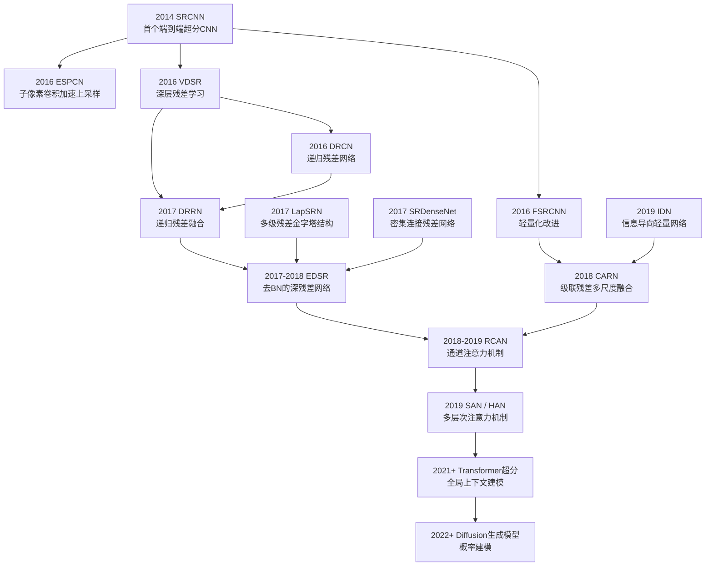

# 模型介绍与规范化标准

本篇介绍超分辨常用的神经网络技术，包括：

1. `CNN` 网络原理与结构

2. `VAE` 网路原理与结构

3. `GAN` 网络原理与结构

5. `ResNet` 网络原理与结构

4. `DIFFUSION` 网络原理与结构

5. `Transformer` 网络原理与结构

6. 特殊架构模型




模型命名规则格式:

```
[模型架构]_[实验代号]_[训练轮数]epo_[批大小]bth_[数据集简写]_[版本].pth
```

字段说明:

| 字段名   | 示例                           | 含义说明                         |
| ----- | ---------------------------- | ---------------------------- |
| 模型架构  | `CNN` / `DIFFUSION` / `ResNet`    | 网络模型名称，便于快速识别所用架构            |
| 实验代号  | `EXP01`                    | 训练实验的编号或标签，用于区分不同实验          |
| 训练轮数  | `400epo`                     | 训练的 epoch 数，便于识别训练时长         |
| 批大小   | `32bth`                      | 批次大小，表示一次训练迭代中使用的样本数量        |
| 数据集简写 | `poisson`            | 训练数据集文件名简写，便于快速关联数据集         |
| 版本号   | `v1` / `v2`                  | 模型版本号，便于模型迭代更新及版本管理（可省略）          |

示例:

```
CNN_EXP01_400epo_32bth_poisson.pth
```

模型存储方式介绍:

> 本模型以 PyTorch 的 `.pth` 格式存储，包含训练好的权重参数，命名规则反映了模型的架构、训练配置与对应数据集，方便版本管理和快速定位。

在代码配置中的规范写法示例:

```python
TRAIN_EXP_NAME        = "EXP_0_1"
TRAIN_MODEL_NAME      = "CNN"
TRAIN_MODEL_PY        = PROJ_ROOT / "LHAI" / "models" / f"{TRAIN_MODEL_NAME}_{TRAIN_EXP_NAME}.py"
TRAIN_DATA_DIR        = PROJ_ROOT / "data" / "POISSON"
TRAIN_DATA_NAME       = "poisson_src_bkg.pkl.npy"
TRAIN_DATA_PATH       = TRAIN_DATA_DIR / TRAIN_DATA_NAME
TRAIN_SEED            = 0
TRAIN_TYPE            = "poissonsrc+bkg_highresorig"
TRAIN_FRAC            = 0.8
TRAIN_EPOCHS          = 400
TRAIN_BATCH_SIZE      = 32
TRAIN_LATENT_DIM      = 64
TRAIN_LR_MAX          = 5e-4
TRAIN_LR_MIN          = 5e-6
```