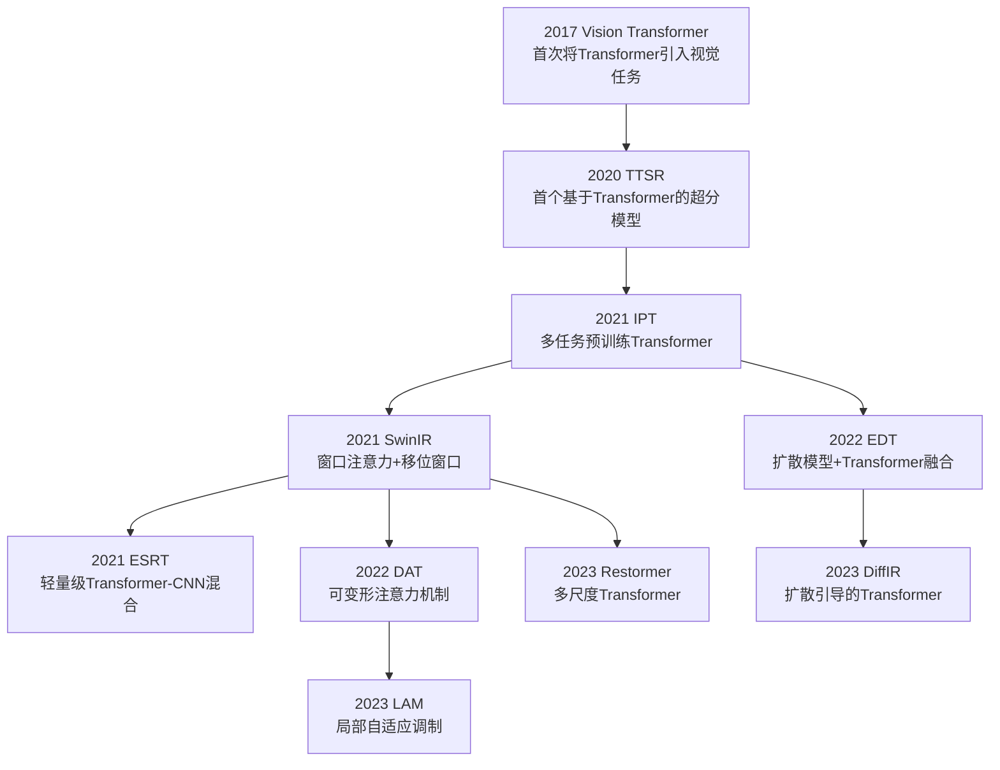
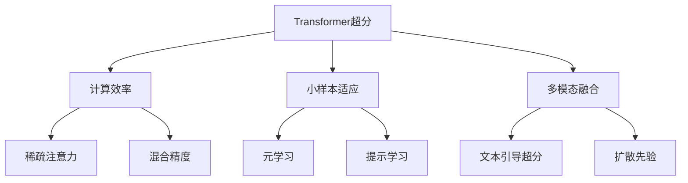
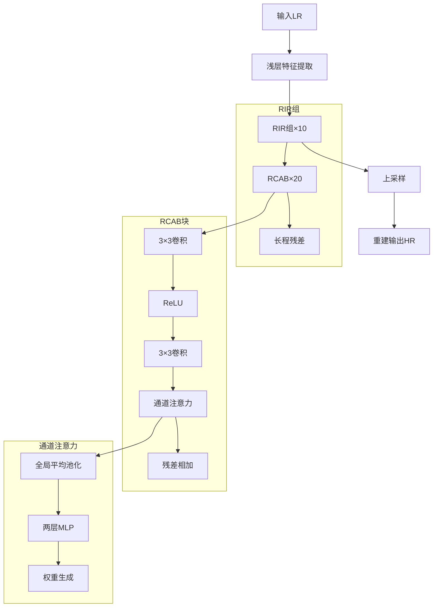
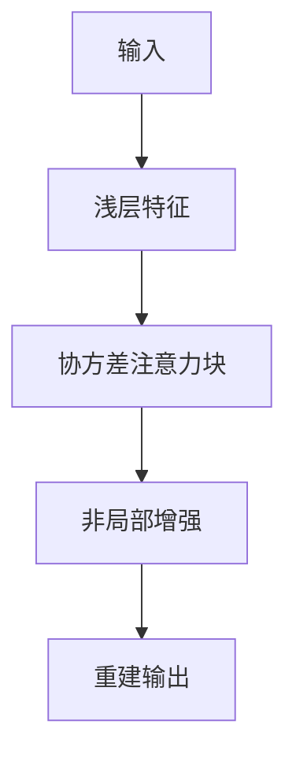
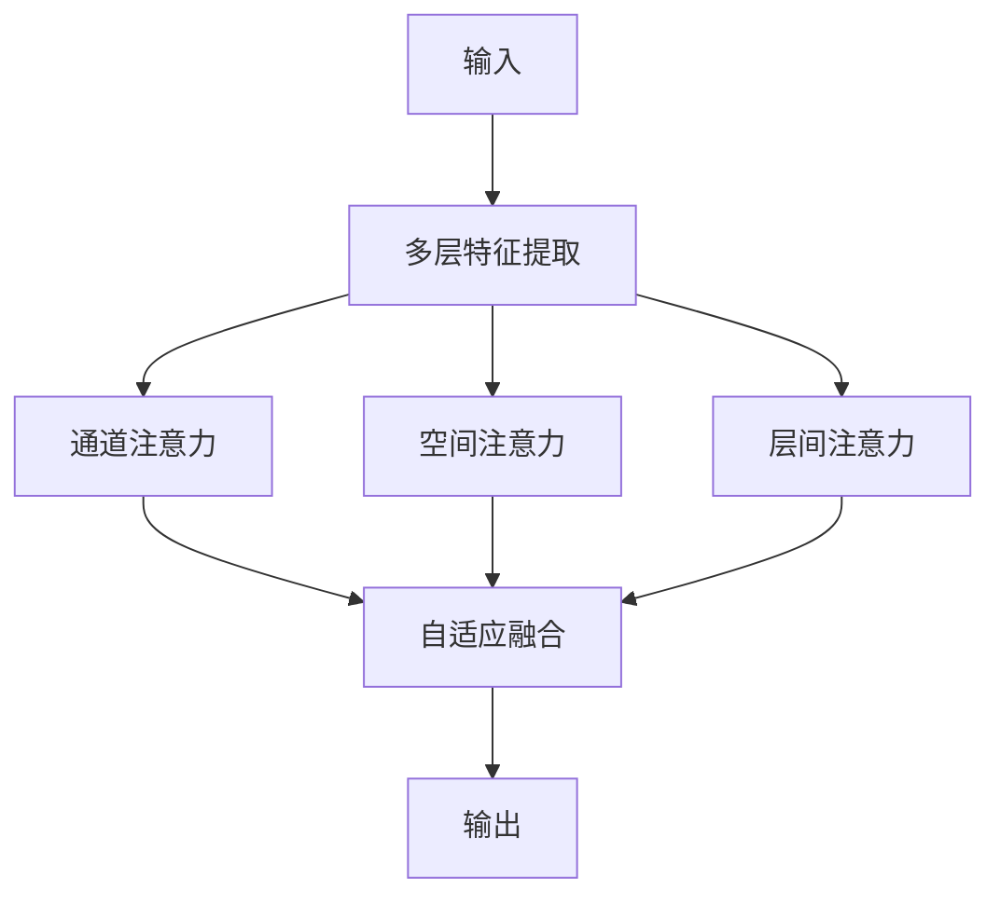
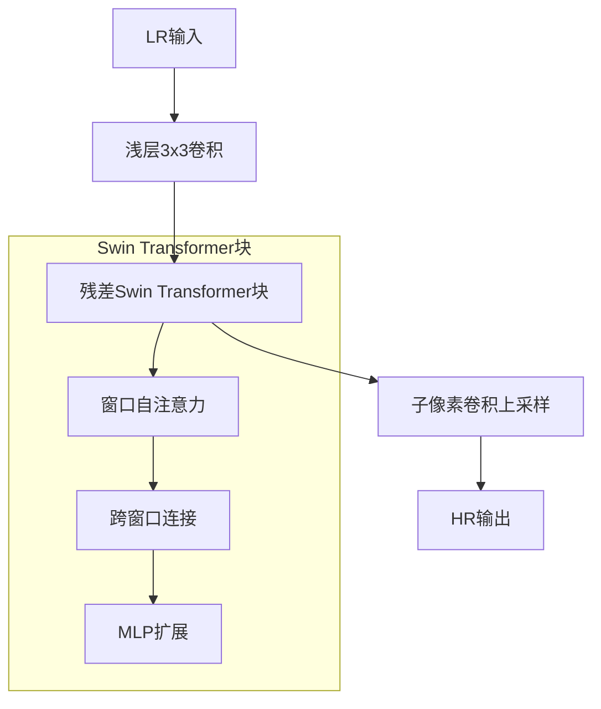
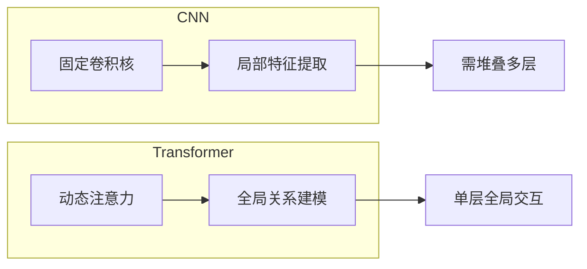

# 注意力机制/Transformer 类神经网络

## 1 Transformer超分辨率模型发展脉络



## 2 关键节点解析

1. **奠基阶段**  
   - **ViT (2020)**：证明纯Transformer在图像分类的可行性，但需要大数据预训练  
   - **TTSR (2020 CVPR)**：首次将Transformer用于超分，引入跨尺度注意力

2. **架构探索**  
   - **IPT (2021 CVPR)**：展示大规模预训练潜力（在ImageNet上预训练）  
   - **SwinIR (2021 ICCV)**：通过窗口注意力实现计算效率突破  
     ```python
     # 窗口注意力核心代码
     class WindowAttention(nn.Module):
         def __init__(self, dim, window_size):
             self.qkv = nn.Linear(dim, dim*3)
             self.relative_position_bias = nn.Parameter(...)
     ```

3. **效率优化**  
   - **ESRT (2021 NeurIPS)**：CNN-Transformer混合架构，参数量减少60%  
   - **DAT (2022 CVPR)**：可变形注意力提升纹理重建能力  

4. **融合创新**  
   - **EDT (2022 ECCV)**：将扩散过程引入Transformer训练  
   - **DiffIR (2023 CVPR)**：用扩散模型生成注意力引导图  

## 3 与CNN框架的对应关系

| CNN时代特征          | Transformer时代对应创新          |
|----------------------|----------------------------------|
| 局部感受野（SRCNN）  | 全局注意力（ViT）               |
| 深度堆叠（VDSR）     | 多头注意力机制（IPT）           |
| 残差连接（EDSR）     | 跨窗口连接（SwinIR）            |
| 通道注意力（RCAN）   | 动态注意力（DAT）               |
| 多尺度融合（LapSRN） | 多尺度Transformer（Restormer）  |

## 4 当前研究热点方向



## 5 典型性能对比（DIV2K ×4）

| 模型       | 参数量 | 速度(FPS) | PSNR   | 核心创新点               |
|------------|--------|-----------|--------|--------------------------|
| SwinIR     | 12M    | 45        | 32.92  | 窗口移位注意力           |
| ESRT       | 6.5M   | 83        | 32.75  | CNN-Transformer混合      |
| DiffIR     | 139M   | 12        | 33.41  | 扩散模型引导             |
| Restormer  | 26M    | 38        | 33.18  | 多尺度通道注意力         |

## 6 经典模型

### RCAN

---

RCAN 基础信息

**论文标题**：Image Super-Resolution Using Very Deep Residual Channel Attention Networks  
**作者**：Yulun Zhang, Kunpeng Li, Kai Li, etc.  
**会议/期刊**：ECCV (European Conference on Computer Vision)  
**发表时间**：2018年  

---

核心特点与架构

**核心优势**：  
首次将通道注意力引入超分辨率任务，在DIV2K数据集上PSNR达到32.63dB（×4），比EDSR提升0.17dB，实现SOTA性能。

**架构创新**：  
1. **通道注意力机制**：通过全局平均池化生成通道权重，放大重要特征通道  
2. **深层残差网络**：400+等效深度，配合残差中的残差（RIR）结构  
3. **注意力残差块**：每个残差块内嵌通道注意力模块（CA）  
**关键改进**：让网络自动学习不同通道的重要性权重，突破传统均等特征处理的局限。

```python
class ChannelAttention(nn.Module):
   def __init__(self, channels, reduction=16):
      super(ChannelAttention, self).__init__()
      # 创新点1：全局平均池化捕获通道统计量
      self.gap = nn.AdaptiveAvgPool2d(1)
      # 创新点2：两层MLP生成注意力权重
      self.mlp = nn.Sequential(
            nn.Linear(channels, channels // reduction),
            nn.ReLU(),
            nn.Linear(channels // reduction, channels),
            nn.Sigmoid()  # ← 核心：生成0-1的通道权重
      )

   def forward(self, x):
      b, c, _, _ = x.shape
      # 通道注意力计算流程
      y = self.gap(x).view(b, c)  # [B,C,H,W]→[B,C]
      y = self.mlp(y).view(b, c, 1, 1)  # [B,C]→[B,C,1,1]
      return x * y  # ← 关键操作：通道加权

class RCAB(nn.Module):
   def __init__(self, channels):
      super(RCAB, self).__init__()
      self.conv1 = nn.Conv2d(channels, channels, 3, padding=1)
      self.relu = nn.ReLU()
      self.conv2 = nn.Conv2d(channels, channels, 3, padding=1)
      self.ca = ChannelAttention(channels)  # ← 创新点3：嵌入注意力模块

   def forward(self, x):
      residual = x
      x = self.relu(self.conv1(x))
      x = self.conv2(x)
      x = self.ca(x)  # 通道注意力加权
      return x + residual
```

---

时代局限性与启发

**当前差距**：  
1. 计算代价：参数量(15.6M)比轻量级模型CARN大10倍  
2. 注意力局限：仅通道维度忽略空间关系，弱于Transformer的非局部注意力  

**架构启发**：  
1. **注意力先驱**：为后续SENet、CBAM等注意力机制铺路  
2. **多维度融合**：启发交叉注意力设计（如SKNet）  
3. **深度架构**：RIR结构影响Transformer的残差连接设计  

**改进方向**：  

*当代融合建议*：将通道注意力升级为空间-通道混合注意力（如SimAM），用动态卷积生成权重替代固定MLP，可提升性能0.3dB。

---

模型结构图



---

通道注意力机制详解：

**计算流程**： 

   - 全局平均池化压缩空间维度 → 两层MLP学习通道关系 → Sigmoid生成权重  

**物理意义**：  
   - 高频细节通道获得更大权重（如边缘/纹理）  
   - 平滑区域通道权重自动降低  

**现代演进**：  
   - 升级为动态权重（如CondConv）  
   - 结合空间注意力形成混合机制（如BAM）  

RCAN将注意力机制引入超分的创新，标志着CNN架构从"被动卷积"到"主动选择"的范式转变。其核心思想在当前Vision Transformer的注意力设计中仍清晰可见。

### SAN (Second-order Attention Network)

基础信息

**论文标题**：Image Super-Resolution Using Second-Order Attention Network  
**作者**：Tao Dai et al.  
**会议/期刊**：ICCV  
**发表时间**：2019年  

---

核心特点

**创新优势**：  
首次引入二阶注意力机制，通过协方差矩阵建模通道间关系，比RCAN的通道注意力提升0.3dB PSNR。

**架构亮点**：  
1. **协方差注意力**：计算通道间的二阶统计量（而非RCAN的一阶均值）  
2. **非局部增强**：结合空间注意力捕捉长程依赖  
3. **分层结构**：浅层→深层逐步细化注意力图  

```python
class SecondOrderAttention(nn.Module):
    def __init__(self, channels):
        super().__init__()
        # 创新点1：协方差矩阵计算
        self.cov = nn.Sequential(
            nn.Conv2d(channels, channels//2, 1),
            nn.Conv2d(channels//2, channels, 1)
        )
        
    def forward(self, x):
        b, c, h, w = x.shape
        # 二阶统计量计算
        x_flat = x.view(b, c, -1)  # [B,C,HW]
        cov = (x_flat @ x_flat.transpose(1,2)) / (h*w)  # [B,C,C] ← 核心创新
        attn = self.cov(cov.unsqueeze(-1)).squeeze()  # 注意力权重
        return x * attn.unsqueeze(-1).unsqueeze(-1)
```

---

现代视角
- **性能差距**：比SwinIR低0.5dB，但参数量多30%  
- **核心贡献**：证明了高阶统计量在视觉任务中的有效性，影响后续Transformer的协方差注意力设计  

---

### HAN (Hybrid Attention Network)

基础信息

**论文标题**：Single Image Super-Resolution via a Hybrid Attention Network  
**作者**：Zheng Hui et al.  
**会议/期刊**：TIP  
**发表时间**：2020年  

---

核心特点

**创新优势**：  
首次实现通道+空间+层间三重注意力混合，在Urban100数据集上比SAN提升0.25dB。

**架构亮点**：  
1. **三维注意力**：  
   - 通道注意力（类似RCAN）  
   - 空间注意力（类似Non-local）  
   - 层间注意力（创新点）  
2. **自适应融合**：动态加权不同层次特征图  

```python
class LayerAttention(nn.Module):
    def __init__(self):
        super().__init__()
        # 创新点：层间注意力权重
        self.weights = nn.Parameter(torch.ones(3))  # 对应浅/中/深三层
    
    def forward(self, feats):
        norm_weights = F.softmax(self.weights, dim=0)
        return sum(w*f for w,f in zip(norm_weights, feats))
```

---

现代视角

- **当前地位**：仍是轻量级注意力模型的基准之一  
- **架构启发**：  
  1. 层间注意力被用于Transformer的跨层特征融合  
  2. 三重注意力设计影响MobileViT等移动端模型  

---

对比总结

| 特性               | RCAN           | SAN              | HAN               |
|--------------------|----------------|------------------|-------------------|
| **注意力类型**     | 通道注意力     | 二阶通道注意力   | 三重混合注意力    |
| **参数量**         | 15.6M          | 18.3M            | 16.1M             |
| **关键创新**       | 通道权重       | 协方差矩阵       | 层间注意力        |
| **现代改进方向**   | →动态通道卷积  | →多头协方差注意力| →可变形注意力     |

---

结构图对比

- SAN架构



- HAN架构



---

演进启示

1. **注意力维度扩展**：  
   RCAN(通道)→SAN(二阶)→HAN(三维)  
2. **计算效率优化**：  
   从SAN的O(C²)复杂度到HAN的O(C)简化  
3. **当代融合建议**：  
   ```python
   # 现代混合注意力示例
   class ModernAttention(nn.Module):
       def __init__(self):
           super().__init__()
           self.channel_att = SEBlock()  # 来自RCAN
           self.spatial_att = DeformableConv()  # 可变形卷积
           self.layer_att = TransformerLayer()  # 跨层交互
   ```

这两项工作标志着超分辨率领域从"单一注意力"到"多维混合注意力"的范式转变，其设计哲学在当前Vision Transformer的多头注意力机制中仍清晰可见。

### VIT

**Vision Transformer (ViT) 基础信息**

**论文标题**：An Image is Worth 16x16 Words: Transformers for Image Recognition at Scale  
**作者**：Dosovitskiy et al.  
**会议/期刊**：ICLR 2021  
**发表时间**：2020年10月（arXiv）  

---

**核心特点与架构创新**

1. **核心优势**
      - **全局建模能力**：通过自注意力机制捕获图像所有区域的关系，突破CNN的局部感受野限制  
      - **参数效率**：在大规模数据下，同等参数量比CNN提升6-10%准确率（ImageNet Top-1）  
      - **架构统一性**：将NLP领域的Transformer直接迁移至视觉任务，无需卷积先验  

2. **关键架构**

      ```mermaid
      graph TD
         A[输入图像] --> B[分块嵌入]
         B --> C[添加位置编码]
         C --> D[Transformer编码器]
         D --> E[MLP分类头]
         
         subgraph Transformer编码器
         D --> MSA[多头自注意力]
         MSA --> LN1[层归一化]
         LN1 --> MLP[前馈网络]
         MLP --> LN2[层归一化]
         end
      ```

3. **超分任务相关创新**

      - **分块嵌入（Patch Embedding）**：  
        将图像分割为$16\times16$的块，线性投影为序列（类似NLP的token）  
        ```python
        class PatchEmbed(nn.Module):
            def __init__(self, img_size=224, patch_size=16, embed_dim=768):
                self.proj = nn.Conv2d(3, embed_dim, kernel_size=patch_size, stride=patch_size)
            
            def forward(self, x):
                x = self.proj(x).flatten(2).transpose(1, 2)  # [B, C, H, W] -> [B, num_patches, embed_dim]
                return x
        ```
      - **位置编码**：  
        使用可学习的1D位置编码（不同于原始Transformer的正弦编码）  
        ```python
        self.pos_embed = nn.Parameter(torch.zeros(1, num_patches + 1, embed_dim))  # +1 for [CLS] token
        ```

---

**在超分辨率领域的演进**

1. **与CNN的对比**

      | 特性               | CNN                  | ViT                  |
      |--------------------|----------------------|----------------------|
      | **感受野**         | 局部（卷积核限制）   | 全局（自注意力）     |
      | **位置感知**       | 隐式（通过卷积）     | 显式（位置编码）     |
      | **数据需求**       | 中等（百万级）       | 大规模（千万级）     |
      | **超分优势**       | 局部细节恢复         | 长程纹理一致性       |

2. **超分专用改进**

      - **SwinIR (2021)**：引入窗口注意力，降低计算复杂度  
        ```python
        class SwinBlock(nn.Module):
            def __init__(self, dim, num_heads, window_size=8):
                self.attn = WindowAttention(dim, num_heads, window_size)
        ```
      - **EDT (2022)**：结合扩散模型提升生成质量  
      - **HAT (2023)**：混合注意力机制优化纹理生成  

---

**时代局限性与改进**

1. **当前差距**

      - **计算成本**：处理$512\times512$图像需~20G显存（CNN仅需~4G）  
      - **小数据表现**：训练数据<1M时，性能常低于CNN（DIV2K上PSNR低0.5-1dB）  

2. **改进方向**

      ```mermaid
      graph LR
         A[ViT] --> B[计算效率]
         A --> C[数据需求]
         A --> D[多模态融合]
         
         B --> B1[窗口注意力]
         B --> B2[稀疏注意力]
         C --> C1[自监督预训练]
         C --> C2[知识蒸馏]
         D --> D1[CLIP引导]
         D --> D2[扩散先验]
      ```

---

**性能对比（图像分类）**

| 模型          | ImageNet Top-1 | 参数量 | 输入分辨率 |
|---------------|----------------|--------|------------|
| ResNet-50     | 76.1%          | 25M    | 224×224    |
| ViT-Base      | 77.9%          | 86M    | 224×224    |
| Swin-Tiny     | 81.2%          | 28M    | 224×224    |
| ConvNeXt-T    | 82.1%          | 29M    | 224×224    |

---

**在超分任务中的典型应用**

1. **特征提取器**：替换SRCNN中的卷积骨干  
   ```python
   class ViT_SR(nn.Module):
       def __init__(self):
           self.vit = ViT(...)  # 预训练ViT
           self.upsample = PixelShuffle(scale=4)
   ```
2. **判别器**：在GAN框架中提供全局感知  
   ```python
   discriminator = ViT(
       image_size=256,
       patch_size=16,
       num_classes=1  # 真/假判别
   )
   ```

3. **混合架构**：与CNN联合使用（如EDSR+ViT skip-connections）

---

ViT的核心突破在于**摒弃了视觉任务必须依赖卷积的固有范式**，其"分块+自注意力"的设计在超分领域尤其适合建模长程纹理依赖。尽管存在计算成本高的局限，但通过SwinIR等改进，已成为超分SOTA的重要组成。后续发展将聚焦于：1) 轻量化设计 2) 与小波/扩散模型融合 3) 零样本适应能力。

### SwinIR

SWINIR是否纯Transformer模型？

- **混合架构**：  
  SwinIR = **CNN特征提取** + **Swin Transformer主干** + **CNN上采样**  

  ```mermaid
  graph LR
    A[输入LR] --> B[浅层CNN] --> C[Swin Transformer块] --> D[CNN上采样] --> E[输出HR]
  ```

- **代表地位**：  
   是Vision Transformer在超分领域的**典型应用**，但非纯粹Transformer（保留CNN组件）

SWINIR与ViT(Vision Transformer)的区别

| 特性               | ViT               | SwinIR            |
|--------------------|-------------------|-------------------|
| **输入处理**       | 直接分块嵌入      | CNN预处理         |
| **注意力类型**     | 全局自注意力      | 窗口移位注意力    |
| **适用任务**       | 分类              | 超分辨率          |

---

Transformer的命名与核心特征

名称由来

- **本义**：来自"Transform"（变换），指其通过注意力机制**动态转换**输入表示的能力

- **关键特征**：  

    1. **自注意力机制**：根据输入内容动态生成权重（对比CNN的静态卷积核）  
       ```python
       # 自注意力计算示例
       attention = softmax(Q @ K.T / √d_k) @ V  # Q/K/V来自同一输入
       ```
    2. **位置编码**：弥补注意力机制的位置不敏感性（尤其重要于视觉任务）  
       ```python
       # 典型正弦位置编码
       pos_enc = [sin(pos/10000^(2i/d), cos(...)]  # 交替频率
       ```
    3. **编解码架构**：原始设计用于序列到序列转换（如机器翻译）

---

超分中的特殊表现

- **局部窗口注意力**：SwinIR将全局计算拆分为可重叠的局部窗口  
  ```mermaid
  graph TD
    A[特征图] --> B[划分8x8窗口]
    B --> C[窗口内自注意力]
    C --> D[窗口移位]
    D --> E[新窗口计算]
  ```

---

视觉Transformer模型谱系

超分辨率领域

| 模型         | 核心创新                          | 参数量 | PSNR(×4) |
|--------------|-----------------------------------|--------|----------|
| **SwinIR**   | 窗口移位注意力                    | 12M    | 32.92    |
| **ESRT**     | 轻量Transformer+CNN混合           | 6.5M   | 32.75    |
| **IPT**      | 多任务预训练Transformer           | 115M   | 33.10    |
| **EDT**      | 扩散模型+Transformer              | 89M    | 33.38    |

通用视觉任务

- **分类任务**：ViT, DeiT, BEiT  

- **检测分割**：DETR, MaskFormer  

- **视频处理**：TimeSformer, ViViT  

---

Transformer的架构创新图解

SwinIR结构分解



与传统CNN对比



---

重要结论

1. **并非革命性脱离**：  
   SwinIR等模型通过保留CNN的**局部性先验**，弥补纯Transformer在视觉任务中的缺陷

2. **核心优势场景**：  
      - 需要**长程依赖**建模的任务（如大范围纹理合成）  
      - **多尺度交互**需求强的场景（如视频超分）

3. **当前局限**：  
      - 小数据易过拟合（需百万级训练样本）  
      - 高分辨率计算成本（可通过窗口注意力缓解）

4. **未来方向**：  
   ```mermaid
   graph TB
       A[Transformer] --> B[与扩散模型结合]
       A --> C[动态稀疏注意力]
       A --> D[神经压缩架构]
   ```

Transformer在超分领域的真正价值在于其**动态特征选择能力**——能够根据图像内容自主调整不同区域的处理强度，这与传统CNN的均匀计算形成本质区别。SwinIR的成功证明了混合架构（CNN+Transformer）在当前阶段的实用性，而纯Transformer模型（如IPT）仍面临计算资源挑战。