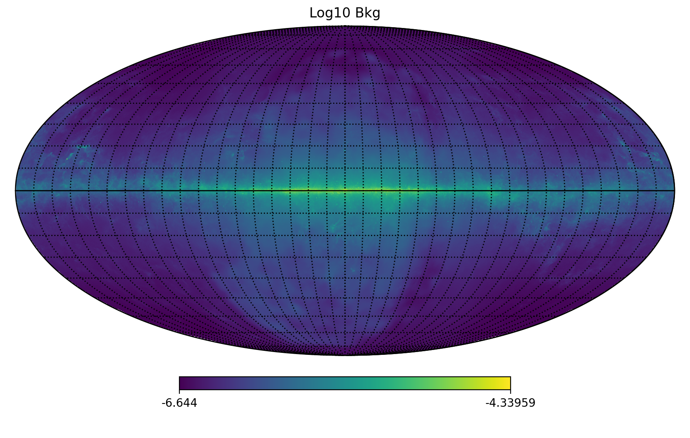
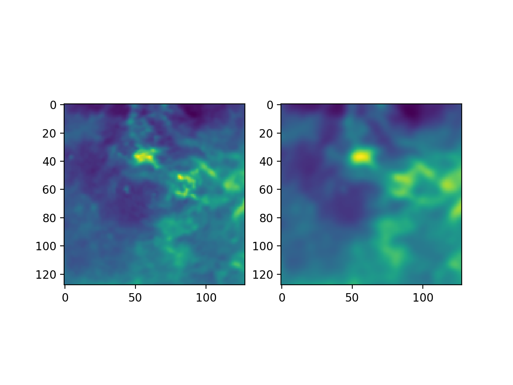

# Simulation

## Introduction

For supervised training, we need two groups of data -- the intensity map and the counts map. 

The former is the target map, which refers to intrinsic flux distribution of the gamma-ray source. With the machine learning model, we aim at recover this intensity map from the observed counts map.

The latter is the spacial event distribution detected by instruments, therefore affected by system error and random fluctuation. Both WCDA and KM2A have the problem of misclassifying cosmic ray events as gamma-ray events, thus there is also cosmic ray background. As a result of the direction reconstruction error, the morphology of gamma-ray source is affected by the spacial uncertainty and blurred with the point spread function (PSF). 

Therefore, in order to simulate the instrument response, we need to consider the gamma-ray background, the source intensity, localization uncertainty and also the cosmic ray background. At present we did not add the CR background. Instead, we assume the sample are pure gamma-ray events. Also, a practical method to imitate the localization error is to adopt a PSF, which is yield from atmospheric air shower Monte Carlo simulations. 

## Gamma-ray Background

#### Diffusive Gamma-Ray Background Model
[The diffusive gamma-ray background model](https://fermi.gsfc.nasa.gov/ssc/data/access/lat/BackgroundModels.html) published by Fermi LAT is derived from multi-wavelength observation of the diffusive gas in the galaxy. The original background data is saved in FITS, binned in 28 energy bins. We convert it into HEALPix data using Python package [healpy](https://healpy.readthedocs.io/). Now the angular resolution of the data (pixel width) is approximately $0.1\deg$. 

By selecting different region on the all-sky map, we get the intensity map of the gamma-ray background. The selected pixels are then interpolated to the cartesian coordinate with pixel width $\delta x = 0.1\deg$. For convenience, we select $6.5\times 6.5\deg$ region, which result in $64\times 64$ array. 

### Point Spread Function

The PSF assumption is a rough method and serves only for the preliminary attempts. By setting a symmetric PSF, we have assumed each events have the same localization error. In reality, this is not the case. The PSF is declination and energy dependent, and not necessarily symmetric.

With a 2D convolution with PSF on the selected intensity map, we get the blurred sky map.

### Random Fluctuation

Now the sky map we have is still some kinds of blurred intensity map, as value of each pixel reflects the expectation value of counts number. Photos could be regarded as produced by random Poisson process. We did some sampling with the pixel value as parameter of a Poisson distribution to simulate the random photon fluctuation. The strength of fluctuation depends on observation duration. Longer exposure time means higher signal-to-noise ratio and better imaging quality and vice versa. 

by Xingwei Gong
