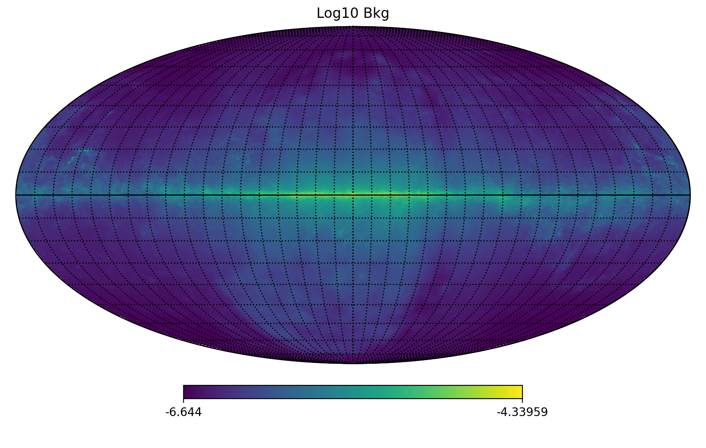

# 模拟

## 介绍

对于监督学习训练，我们需要两类数据—— **强度图** 和 **计数图**。

前者是目标图，指的是伽马射线源的本征光流分布。通过机器学习模型，我们旨在从观测到的计数图中还原该强度图。

后者是仪器检测到的空间事件分布，因此受到系统误差和随机波动的影响。无论是 WCDA 还是 KM2A，都存在将宇宙射线事件误分类为伽马射线事件的问题，因此数据中也包含宇宙射线背景。由于方向重建误差，伽马射线源的形态会受到空间不确定性的影响，并与点扩散函数（PSF）一起被模糊化。

因此，为了模拟仪器响应，我们需要考虑伽马射线背景、源强度、定位误差以及宇宙射线背景。目前，我们未添加宇宙射线背景，而是假设样本为纯伽马射线事件。此外，一种模拟定位误差的实际方法是采用基于大气簇射蒙特卡罗模拟生成的 PSF。

## 伽马射线背景

### 漫射伽马射线背景模型

[费米 LAT 提供的漫射伽马射线背景模型](https://fermi.gsfc.nasa.gov/ssc/data/access/lat/BackgroundModels.html) 基于对银河系中漫射气体的多波段观测得出。原始背景数据以 FITS 格式存储，分为 28 个能量区间。我们使用 Python 库 [healpy](https://healpy.readthedocs.io/) 将其转换为 HEALPix 数据。当前数据的角分辨率（像素宽度）约为 $0.1\deg$。

通过在全天图上选择不同区域，我们可以获取伽马射线背景的强度图。选择的像素随后被插值为笛卡尔坐标，像素宽度为 $\delta x = 0.1\deg$。为便于计算，我们选择 $6.5\times6.5\deg$ 的区域，这会生成 $64\times64$ 的数组。

### 点扩散函数（PSF）

PSF 的假设是一种粗略方法，仅用于初步尝试。设定对称 PSF 意味着假定每个事件的定位误差相同，而实际情况并非如此。PSF 会随赤纬和能量变化，且不一定是对称的。

通过对选定强度图进行 PSF 的二维卷积，我们可以得到模糊化的天空图。

### 随机波动

目前得到的天空图仍然是某种模糊强度图，因为每个像素值反映了计数数目的期望值。伽马射线照片可以被看作是随机泊松过程的产物。我们根据像素值作为泊松分布参数进行了抽样，以模拟随机光子的波动。波动强度取决于观测时长，曝光时间越长，信噪比越高，成像质量越好；反之亦然。

作者：龚星炜
 
